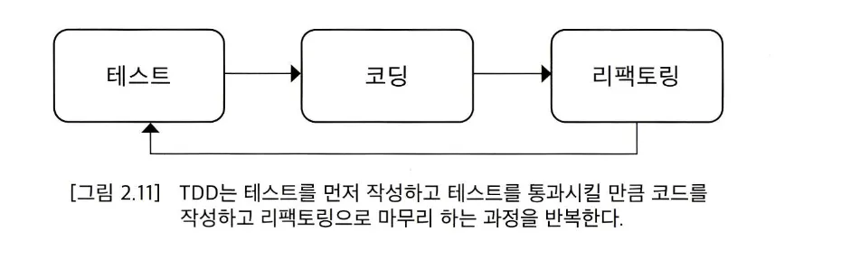

# Ch02. TDD 시작

## TDD란?

- TDD는 먼저 테스트하고 그 다음에 구현한다.
    - 기능을 검증하는 테스트 코드를 먼저 작성하고 테스트를 통과시키기 위해 개발을 진행한다.
- TDD는 테스트를 먼저 작성하고 테스트에 실패하면 테스트를 통과
  시킬 만큼 코드를 추가하는 과정을 반복하면서 점진적으로 기능을 완성해 나간다

## TDD예시 : 암호 검사기

1. 첫 번째 테스트를 선택할 때에는 가장 쉽거나 가장 예외적인 상황을 선택해야 한다.
        - 모든 규칙을 충족하는 경우
        - 모든 조건을 충족하지 않는 경우
    - TDD는 테스트를 통과시킬 만큼의 코드를 작성한다.
2. 코드 정리
    - 테스트 코드도 코드이기 때문에 유지보수 대상이다.
    - 테스트 메서드에서 발생하는 중복을 알맞게 제거하거나 의미가 잘 드러나게 수정할 필요가 있다.
    - 테스트 코드의 중복을 무턱대고 제거하면 안 된다. 중복을 제거한 뒤에도 테스트 코드의 가독성이 떨어지지 않고 수정이 용이한 경우에만 중복을 제거해야 한다. 중복을 제거한 뒤에 오히려 테스트 코드 관리가 어려워진다면 제거했던 중복을 되돌려야 한다.

## TDD 흐름

- TDD는 기능을 검증하는 테스트를 먼저 작성한다. → 테스트를 통과하지 못하면 테스트를 통과할 만큼만 코드를 작성한다 → 테스트를 통과한 뒤 개선할 코드가 있으면 리팩토링 한다 → 리팩토링을 수행한 뒤에는 다시 테스트를 실행해서 기존 기능이 망가지지 않았는지 확인한다.
- 레 드 -> 그 린 -> 리 팩 터 : TDD 사이클
    - 레드 : 실패하는 테스트
    - 그린 : 성공한 테스트
    - 리팩터 : 리팩토링 과정

### 테스트가 개발을 주도

- 테스트 코드를 먼저 작성하면 테스트가 개발을 주도하게 된다.
- 테스트 코드를 만들면 다음 개발 범위가 정해진다. → 테스트코드가 추가되면서 검증하는 범위가 넓어질 수 록 구현도 점점 완성되어 간다 → 이렇게 테스트가 개발을 주도해 나간다

### 지속적인 코드 정리

- TDD는 개발 과정에서 지속적으로 코드 정리를 하므로 코드 품질이 급격히 나빠지지 않게 막아 주는 효과가 있다. 이는 향후 유지보수 비용을 낮추는데 기여한다.

### 빠른 피드백

- 새로운 코드를 추가하거나 기존 코드를 수정하면 테스트를 돌려서 해당 코드가 올바른지 바로 확인 할 수 있다.