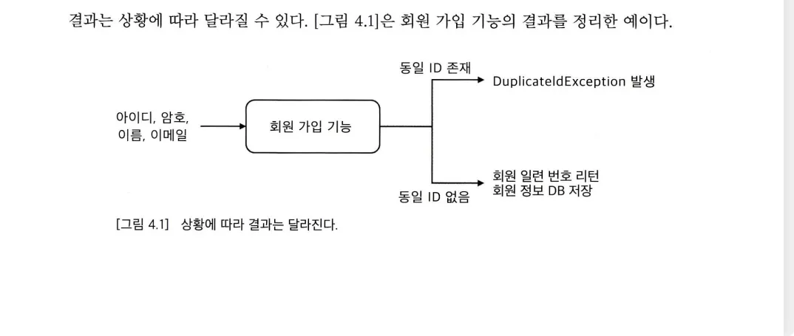

## 기능 명세

- 설계는 기능 명세로부터 시작한다.
    - 다양한 요구사항 문서를 이용해서 기능명세를 구체화하고 → 기능 명세를 구체화 하는 동안 입력과 결과를 도출하고 → 도출한 기능명세를 코드에 반영한다.
    - 기능 명세의 입력과 결과를 코드에 반영하는 과정에서 기능의 이름, 파라미터, 리턴타입 등이 결정 된다.
- 기능은 크게 두가지로 나눌 수 있다 (ex. 로그인기능)
    - 입력 : 기능을 실행하는 데 필요한 값 (아이디와 암호)
    - 결과 : 성공 또는 실패 (아이디와 암호가 일치하면 성공, 일치하지 않으면 실패)
        - 여러 형식으로 정의할 수 있는데 가장 쉬운 결과 형식은 **리턴 값**이다.
        - **Exception** 예외도 결과 형식이 될 수 있다.
        - 변경도 포함된다.
            - 변경은 리턴 값으로는 알 수 없기 때문에 테스트 대상을 실행한 뒤에는 변경 대상에 접근해서 결과를 확인해야 한다.

### 설계과정을 지원하는 TDD

- TDD는 테스트를 만드는 것부터 시작한다. 테스트코드를 먼저 작성하기 위해 무엇이 필요할까?
    - 테스트할 기능을 실행할 수 있어야 한다. → 실행할 수 있는 객체나 함수가 존재해야 한다.
    - 실행 결과를 검증할 수 있어야 한다.

- 테스트 대상이 될 **클래스의 이름** 선정 → 호출할 **메서드 네이밍**, **파라미터** 선택 → **실행 결과** 검증을 위해 리턴 타입을 고민

### 필요한 만큼 설계하기

- TDD는 테스트를 통과할 만큼만 코드를 작성한다.
- 필요할 것으로 예측해서 미리 설계를 유연하게 만들지 않는다.
- 실제 테스트 사례를 추가하고 통과시키는 과정에서 필요한 만큼 설계를 변경한다.
- 모든 코드에 대해 테스트를 먼저 작성할 수 는 없겠지만 TDD로 개발하는 코드 비율이 높아질수록 지금 시점에서 필요한 설계만 코드에 반영할 가능성이 커진다.
- 유연한 설계는 필요한 시점에 추가한다. → 설계가 불필요하게 복잡해지는 것을 방지할 수 있다.

### 기능 명세 구체화

- 모호한 상황을 만나면 이를 구체적인 예로 바꾸어 테스트 코드에 반영한다.
- 즉, 테스트코드는 예를 이용한 구체적인 명세가 된다.
- 테스트 코드를 이용하면 구체적인 예를 이용해서 기능을 바로 실행해 볼 수 있다. 이는 유지보수에 큰 도움이 된다.