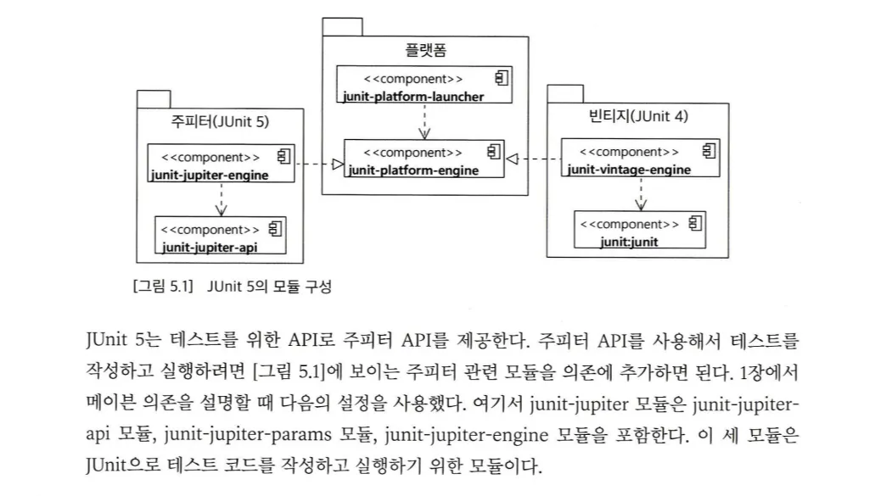

### Junit5 모듈 구성

- Junit platform : 테스팅 프레임워크를 구동하기 위한 런처와 테스트 엔진을 위한 API를 제공한다.
- Junit Jupiter : Junit 5를 위한 테스트 API와 실행 엔진을 제공한다
- Junit Vintage : Junit 3,4 로 작성된 테스트를 Junit5 플랫폼에서 실행하기 위한 모듈을 제공한다.



### 라이프사이클

```java
package com.example.tddstart.ch5;

import org.junit.jupiter.api.AfterEach;
import org.junit.jupiter.api.BeforeEach;
import org.junit.jupiter.api.Test;

public class LifeCycleTest {

    public LifeCycleTest() {
        System.out.println("new LifeCycleTest()");
    }

    @BeforeEach
    void setup() {
        System.out.println("set up");
    }

    @Test
    void a() {
        System.out.println("A test");
    }

    @Test
    void b() {
        System.out.println("B test");
    }

    @AfterEach
    void teardown() {
        System.out.println("tear down");
    }
}

```

실행결과

```java
 * 실행 결과

 * new LifeCycleTest()
 * set up
 * A test
 * tear down

 * new LifeCycleTest()
 * set up
 * B test
 * tear down
```

1. 테스트 메서드 포함 객체 생성
2. @BeforeEach 애노테이션이 붙은 메서드 실행
3. @Test 애노테이션이 붙은 메서드 실행
4. @AfterEach 애노테이션이 붙은 메서드 실행

@Test, @BeforeEach, @AfterEach 애너테이션은 자바 리플렉션을 사용해서 동작하기 때문에 접근 제어자가 private이면 안된다. (최소 default여야 함)