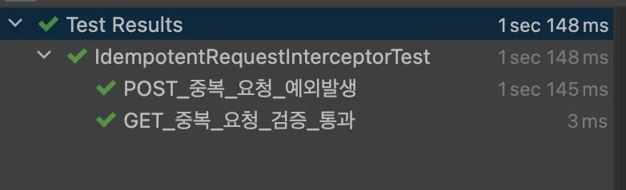

# Redis로 중복요청 방지하기 - Idempotency-Key 적용

어드민 서버에서 중복 요청이 발생하는 경우 때문에 오류가 발생하는 경우가 종종 발생했다. (사용자가 요청 처리 중에 버튼을 여러번 클릭한다던가..프론트 문제로 더블클릭된다던가..) 이런 중복 요청으로인해 중복 데이터가 생성되거나 동일한 작업이 여러번 실행되는 문제가 발생해서 Idempotency-Key를 활용해서 중복 요청을 막기로 했다.

1. 클라이언트에서 요청마다 고유한 키(Idempotency-Key)를 생성해서 Request 헤더에 추가한다.
2. 서버는 Request를 받아서 헤더에 idempotency-key 값이 있는지 확인하고, 있다면 redis에 저장한다. 만약, 해당 값이 이미 redis에 있다면 중복 요청이므로 로직을 진행하지 않는다.
3. 중복 요청 검증은 POST 메서드에 대해서 검증해야 하므로  interceptor에서 해당하는 HTTP 메서드일 때만 검증 로직을 실행하도록 했다.

서버 구현 코드는 다음과 같다.

build.gradle

```bash
dependencies {
    implementation 'org.springframework.boot:spring-boot-starter-web'
    implementation 'org.redisson:redisson-spring-boot-starter:3.42.0'
    testImplementation 'org.springframework.boot:spring-boot-starter-test'
    testRuntimeOnly 'org.junit.platform:junit-platform-launcher'
}
```

- spring data redis 를 이용하면 lettuce 가 기본이므로 redisson 의존성을 추가해줬다.

```java
@Component
public class IdempotentRequestInterceptor implements HandlerInterceptor {

    private static final String IDEMPOTENCY_KEY = "Idempotency-Key";
    private static final Set<String> METHODS = Set.of("POST");

    private static final Logger logger = LoggerFactory.getLogger(IdempotentRequestInterceptor.class);

    private final RedissonClient redissonClient;

    public IdempotentRequestInterceptor(RedissonClient redissonClient) {
        this.redissonClient = redissonClient;
    }

    @Override
    public boolean preHandle(HttpServletRequest request, HttpServletResponse response, Object handler) throws Exception {
        String method = request.getMethod();
        if (!METHODS.contains(method)) {
            return true;
        }

        String key = request.getHeader(IDEMPOTENCY_KEY);
        if (key == null) {
            return true;
        }

        RBucket<String> bucket = redissonClient.getBucket(key);
        boolean success = bucket.setIfAbsent(key, Duration.of(3, ChronoUnit.SECONDS));
        if (!success) {
            logger.error("duplicated request. key : {}", key);
            throw new DuplicateRequestException("duplicated request");
        }
        return true;
    }
}
```

- 먼저 interceptor의 구현을 보면 http method가 POST 인지 검증하고 request 헤더에 idempotency-key 값이 있다면, redis에 3초 동안 저장하도록 구현했다. 저장에 실패했다면 중복 요청이므로DuplicateRequestException이 발생하도록 했다.

```java
@Configuration
public class WebConfiguration implements WebMvcConfigurer {

    private final IdempotentRequestInterceptor idempotentRequestInterceptor;

    public WebConfiguration(IdempotentRequestInterceptor idempotentRequestInterceptor) {
        this.idempotentRequestInterceptor = idempotentRequestInterceptor;
    }

    @Override
    public void addInterceptors(InterceptorRegistry registry) {
        registry.addInterceptor(idempotentRequestInterceptor)
                .addPathPatterns("/**");
    }
}
```

- 그리고 IdempotentRequestInterceptor 를 등록해주면 된다. 모든 POST요청을 중복인지 검증해야 하므로 모든 경로에 대해  IdempotentRequestInterceptor가 적용되도록 했다.

- 이제  IdempotentRequestInterceptor 로직을 테스트 해보자.

```java
@ExtendWith(MockitoExtension.class)
public class IdempotentRequestInterceptorTest {

    @Mock(strictness = Mock.Strictness.LENIENT)
    private RedissonClient redissonClient;

    @Mock
    private HttpServletRequest request;

    @Mock
    private HttpServletResponse response;

    @InjectMocks
    private IdempotentRequestInterceptor interceptor;

    private RBucket bucket;

    @BeforeEach
    void setUp() {
        bucket = mock(RBucket.class);
        when(redissonClient.getBucket(anyString())).thenReturn(bucket);
    }

    @Test
    void GET_중복_요청_검증_통과() throws Exception {
        // given
        when(request.getMethod()).thenReturn("GET");

        // when
        boolean result = interceptor.preHandle(request, response, new Object());

        Assertions.assertTrue(result);
        // Redis 호출 없음
        verifyNoInteractions(redissonClient);
    }

    @Test
    void POST_중복_요청_예외발생() throws Exception {
        when(request.getMethod()).thenReturn("POST");
        when(request.getHeader("Idempotency-Key")).thenReturn("duplicate-key");

        // 중복요청
        when(bucket.setIfAbsent(anyString(), any(Duration.class))).thenReturn(false);

        // 중복요청일때 DuplicateRequestException 발생해야 함
        assertThrows(
                DuplicateRequestException.class,
                () -> interceptor.preHandle(request, response, new Object()),
                "POST 중복 요청시 DuplicateRequestException 발생"
        );
        // redis 호출 검증
        verify(bucket).setIfAbsent(eq("duplicate-key"), any(Duration.class));
    }
}
```

- GET_중복_요청_검증_통과 : GET 메서드일때는 중복 요청 검증을 하지 않으므로 항상 통과하고, redis도 호출하지 않는다.
- POST_중복_요청_예외발생 : POST 요청인데, 중복 요청일 경우에는 DuplicateRequestException이 발생하며, redis 호출 해야한다.

테스트 결과

