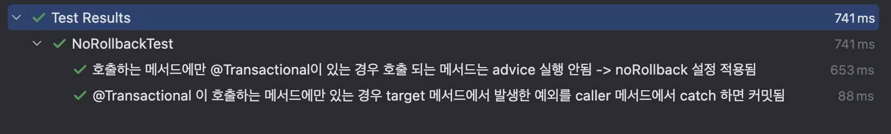

# Spring @Transactional - 프록시 기반 동작방식과 예외상황재현 테스트


@Transactional 의 프록시 기반 작동방식을 간단하게 정리하고 실무에서 겪었던 예외상황을 재현해보고 이유와 해결방법을 구현해봤다.

### 스프링 @Transactional의 동작 방식

- 스프링의 @Transactinal은 TransactionInterceptor 이라는 AOP Advice를 통해 다음 순서로 작동한다.

```java
	1.	클라이언트가 프록시 객체의 메서드 호출
	2.	프록시가 TransactionInterceptor.invoke() 실행
	3.	트랜잭션 처리 전 준비
	4.	invocation.proceed() → 실제 서비스 메서드 실행
	5.	- 메서드 정상 종료 → 트랜잭션 커밋
	    - 예외 발생 → 트랜잭션 롤백
```

- TransactionInterceptor는 Around Advice에 해당하고 `TransactionInterceptor.invoke()` 전체 구조를 간단하게 보면 다음과 같다.

```java
Object invoke(...) {
   시작 전 → 트랜잭션 시작
   try {
       Object result = method.invoke(); // 실제 서비스 메서드
       트랜잭션 커밋
       return result;
   } catch (Throwable ex) {
       트랜잭션 롤백
       throw ex;
   }
}
```

- `TransactionInterceptor.invoke()` 메서드의 동작을 좀더 자세하게 들여다보자

```java
1. 클라이언트가 프록시 객체 메서드 호출 
	- callerService.call()

2. 프록시 객체가 TransactionInterceptor.invoke() 을 실행한다.

3. invokeWithinTransaction 메서드 내부로 진입 (이후 invokeWininTransaction 내부로직)
	- TransactionAttribute txAttr = tas != null ? tas.getTransactionAttribute(method, targetClass) : null;
	- 트랜잭션 어트리뷰트를 가져와서

4. 트랜잭션 매니저 설정
  - TransactionManager tm = this.determineTransactionManager(txAttr, targetClass);

5. 트랜잭션 생성 
  - TransactionInfo txInfo = this.createTransactionIfNecessary(ptm, txAttr, joinpointIdentification); 

6. 실제 비즈니스 메서드 실행 -> 예외발생하면 롤백 여부 판단후 처리
		try {
		     // 실제 서비스로직 실행 
         retVal = invocation.proceedWithInvocation();
    } catch (Throwable ex) {
         // 예외 발생하면 예외처리
           this.completeTransactionAfterThrowing(txInfo, ex);
           throw ex;
    } finally {
           this.cleanupTransactionInfo(txInfo); // ThreadLocal 초기화 (트랜잭션 종료후 정리)
	  }  
7. 예외발생하지 않고, 정상종료되면 커밋
   this.commitTransactionAfterReturning(txInfo);
```

### 예상과 다르게 발생했던 사례

- 예상과 다르게 발생했던 상황들을 간단하게 재현해봤다.
    - 전파속성 : default인 REQUIRED
    - 로그 레벨 : (org.springframework.transaction=TRACE)

- 문제 상황 재현
1. noRollbackFor가 적용되지 않는 상황
    - 하위메서드에서 예외가 발생한경우 상위메서드에서 하위메서드에서 발생한 예외를 noRollbackFor 옵션을 통해 롤백 되지 않게 설정했는데 롤백
    - `CallerService.call(message)`
        - `logRepository.save(new LogEntry(message));`로그를 저장
        - `targetService.doSomething()`호출
        - 해당 메서드의 Transaction에서 RuntimeException에 대해 noRollbackFor 설정
2. 예외를 catch 했는데도 롤백되는 상황
    - 하위 트랜잭션에서 예외가 발생하고 상위 메서드에서 catch 됐지만 커밋 시도할때 예외가 발생해서 롤백
    - `callAndCatchException(message)`
    - `logRepository.save(new LogEntry(message));` 로그를 저장
    - `targetService.doSomething()`호출하고 예외가 발생하면 catch로 잡고 로그 남기고 끝
- `TargetService.doSomething()` 에서는 무조건 RuntimeException을 던진다.

```java
@Slf4j
@Service
@RequiredArgsConstructor
public class CallerServiceImpl implements CallerService {

    private final TargetService targetService;
    private final LogRepository logRepository;

    @Override
    @Transactional(noRollbackFor = RuntimeException.class)
    public void call(String message) {
        log.info("call() - isNewTransaction: {}", TransactionAspectSupport.currentTransactionStatus().isNewTransaction());
        log.info("targetService is proxy: {}", targetService.getClass()); // TargetServiceImpl$$SpringCGLIB$$0 proxy
        logRepository.save(new LogEntry(message));
        targetService.doSomething();
    }

    @Override
    @Transactional
    public void callAndCatchException(String message) {
        log.info("[call] >>>>> TransactionInterceptor START (Advice - before method)");
        log.info("[call] isActualTransactionActive: {}", TransactionSynchronizationManager.isActualTransactionActive());
        log.info("[call] isNewTransaction: {}", TransactionAspectSupport.currentTransactionStatus().isNewTransaction());
        log.info("[call] isRollbackOnly (before): {}", TransactionAspectSupport.currentTransactionStatus().isRollbackOnly());
        logRepository.save(new LogEntry(message));
        try {
            log.info("[call] targetService is proxy: {}", targetService.getClass()); // TargetServiceImpl$$SpringCGLIB$$0 proxy
            targetService.doSomething();
        } catch (RuntimeException e) {
            log.info("[call] caught exception: {}", e.getClass().getSimpleName());
        }
        log.info("[call] isRollbackOnly (after): {}", TransactionAspectSupport.currentTransactionStatus().isRollbackOnly());
        log.info("[call] <<<<< TransactionInterceptor END (Advice - after method)");
    }
}

@Slf4j
@Service
@RequiredArgsConstructor
public class TargetServiceImpl implements TargetService {

    @Override
    @Transactional
    public void doSomething() {
        log.info("{} : doSomething() - isNewTransaction: {}", this.getClass(), TransactionAspectSupport.currentTransactionStatus().isNewTransaction());
        log.info("{} : doSomething() - isActualTransactionActive: {}", this.getClass(), TransactionSynchronizationManager.isActualTransactionActive());
        log.info("TargetService.doSomething() - getCurrentTransactionName: {}", TransactionSynchronizationManager.getCurrentTransactionName());
        log.info("TargetServiceImpl doSomething throw RuntimeException");
        throw new RuntimeException();
    }
}
```

### 예외상황 테스트

```java
@Slf4j
@SpringBootTest
class RollbackTest {

    @Autowired
    CallerService callerService;

    @Autowired
    LogRepository logRepository;

    @BeforeEach
    void setUp() {
        logRepository.deleteAll();
    }

    @Test
    @DisplayName("caller 클래스 메서드에서 target 클래스 메서드를 호출했을 때 " +
            "target 클래스에서 발생한 예외에 대해 caller 메서드에서 noRollback 설정한 경우 " +
            "noRollback 설정은 무시되고 롤백됨")
    void noRollbackFor_shouldBeIgnored() {
        String message = "no-rollback-test";

        assertThrows(RuntimeException.class, () -> {
            callerService.call(message);
        });

        // caller proxy : CallerServiceImpl$$SpringCGLIB$$0.caller
        // target proxy : TargetServiceImpl$$SpringCGLIB$$0.doSomething
        // TransactionInterceptor : Application exception overridden by commit exception -> rollbackOnly가 마킹되어서 커밋되지 않고 롤백됨

        boolean exists = logRepository.existsByMessage(message);
        assertFalse(exists); // 롤백됐으므로 exists = false
    }

    @Test
    @DisplayName("target 메서드에서 발생한 예외를 caller 메서드에서 catch 해도 커밋되지 않고 롤백됨")
    void catchException_shouldStillRollback() {
        String message = "catch-rollback-test";

        assertThrows(UnexpectedRollbackException.class, () -> {
            callerService.callAndCatchException(message); // TransactionException 발생 -> 롤백 됨
        });

        boolean exists = logRepository.existsByMessage(message);
        assertFalse(exists); // 롤백됐으므로 exists = false
    }
}
```

- callAndCatchException 테스트 로그를 살펴보면

```java
2025-04-08T21:27:54.847+09:00  INFO 69412 --- [spring-boot-test] [    Test worker] c.e.s.service.CallerServiceImpl          : [call] >>>>> TransactionInterceptor START (Advice - before method)
2025-04-08T21:27:54.848+09:00  INFO 69412 --- [spring-boot-test] [    Test worker] c.e.s.service.CallerServiceImpl          : [call] isActualTransactionActive: true
2025-04-08T21:27:54.848+09:00  INFO 69412 --- [spring-boot-test] [    Test worker] c.e.s.service.CallerServiceImpl          : [call] isNewTransaction: true
2025-04-08T21:27:54.848+09:00  INFO 69412 --- [spring-boot-test] [    Test worker] c.e.s.service.CallerServiceImpl          : [call] isRollbackOnly (before): false
2025-04-08T21:27:54.861+09:00 DEBUG 69412 --- [spring-boot-test] [    Test worker] org.hibernate.SQL                        : 
    insert 
    into
        log_entry
        (message) 
    values
        (?)
Hibernate: 
    insert 
    into
        log_entry
        (message) 
    values
        (?)
2025-04-08T21:27:54.878+09:00  INFO 69412 --- [spring-boot-test] [    Test worker] c.e.s.service.CallerServiceImpl          : [call] targetService is proxy: class com.example.springboottest.service.TargetServiceImpl$$SpringCGLIB$$0
2025-04-08T21:27:54.878+09:00  INFO 69412 --- [spring-boot-test] [    Test worker] c.e.s.service.TargetServiceImpl          : class com.example.springboottest.service.TargetServiceImpl : doSomething() - isNewTransaction: false
2025-04-08T21:27:54.878+09:00  INFO 69412 --- [spring-boot-test] [    Test worker] c.e.s.service.TargetServiceImpl          : class com.example.springboottest.service.TargetServiceImpl : doSomething() - isActualTransactionActive: true
2025-04-08T21:27:54.879+09:00  INFO 69412 --- [spring-boot-test] [    Test worker] c.e.s.service.TargetServiceImpl          : TargetServiceImpl doSomething throw RuntimeException
2025-04-08T21:27:54.879+09:00  INFO 69412 --- [spring-boot-test] [    Test worker] c.e.s.service.CallerServiceImpl          : [call] caught exception: RuntimeException
2025-04-08T21:27:54.879+09:00  INFO 69412 --- [spring-boot-test] [    Test worker] c.e.s.service.CallerServiceImpl          : [call] isRollbackOnly (after): true
2025-04-08T21:27:54.879+09:00  INFO 69412 --- [spring-boot-test] [    Test worker] c.e.s.service.CallerServiceImpl          : [call] <<<<< TransactionInterceptor END (Advice - after method)
```

- TargetServiceImpl doSomething throw RuntimeException
- caught exception: RuntimeException
- isRollbackOnly (after): true → 롤백온리 마크가 true로 찍혀서 롤백되는 걸 볼 수 있다.

### 해결방법은?

- 하위 메서드에서 트랜잭션을 제거하여 상위 트랜잭션에 병합시키기
- `TargetService.doSomething` 메서드에 `@Transactional` 을 제거하고 CallerSerivce에서 시작한 트랜잭션에 병합시켰다.

```java
    @Override
    public void doSomething(String message) {
        log.info("TargetService.doSomething({}) - isNewTransaction: {}", message, TransactionAspectSupport.currentTransactionStatus().isNewTransaction());
        log.info("TargetService.doSomething({}) - isActualTransactionActive: {}", message, TransactionSynchronizationManager.isActualTransactionActive());
        log.info("TargetService.doSomething({}) - getCurrentTransactionName: {}", message, TransactionSynchronizationManager.getCurrentTransactionName());

        throw new RuntimeException(message);
    }
```

- 의도한대로 동작하는지 테스트

```java
@Slf4j
@SpringBootTest
class NoRollbackTest {

    @Autowired
    CallerService callerService;

    @Autowired
    LogRepository logRepository;

    @BeforeEach
    void setUp() {
        logRepository.deleteAll();
    }

    @Test
    @DisplayName("호출하는 메서드에만 @Transactional이 있는 경우 호출 되는 메서드는 advice 실행 안됨 -> noRollback 설정 적용됨")
    void noRollbackFor_shouldBeCommitted() {
        String message = "no-rollback-test";

        assertThrows(RuntimeException.class, () -> {
            callerService.callNoRollback(message);
        });

        boolean exists = logRepository.existsByMessage(message);
        assertTrue(exists); // 예외가 발생해도 RuntimeException 예외에 대해 noRollback 설정이 적용됐으므로 커밋되었다.
    }

    @Test
    @DisplayName("@Transactional 이 호출하는 메서드에만 있는 경우 target 메서드에서 발생한 예외를 caller 메서드에서 catch 하면 커밋됨")
    void catchException_shouldBeCommitted() {
        String message = "catch-rollback-test";

				assertDoesNotThrow(() -> {callerService.callCatchException(message);});

        boolean exists = logRepository.existsByMessage(message);
				assertTrue(exists);
    }
}
```


### 문제코드와 해결한 뒤 코드의 실행로그 비교

- Getting trasaction for [fully-qualified-method-name] :  Advice가 실행되는 프록시 객체가 호출한 메서드 기준으로 찍히는 로그
    - TransactionInterceptor 내부에서 남기는 것으로 Advice가 실행되는 시점에 어떤 메서드에 트랜잭션을 적용하고 있는 지를 알려준다
1. 문제코드 로그

```java
TRACE TransactionInterceptor : Getting transaction for [CallerServiceImpl.call]
TRACE TransactionInterceptor : Getting transaction for [TargetServiceImpl.doSomething]
... 생략
TRACE TransactionInterceptor : Completing transaction for [TargetServiceImpl.doSomething] after exception
TRACE TransactionInterceptor : Completing transaction for [CallerServiceImpl.call] after exception
```

1. 해결 후 코드 로그

```java
c.e.s.service.CallerServiceImpl          : targetService : class com.example.springboottest.service.TargetServiceImpl$$SpringCGLIB$$0
TRACE TransactionInterceptor : Getting transaction for [CallerServiceImpl.callNoRollback]
TRACE TransactionInterceptor : Getting transaction for [SimpleJpaRepository.save]
... 생략
(no entry for TargetServiceImpl.doSomething(String))
```

- 1번 로그와는 다르게 TransactionInterceptor에서 찍는 `Getting transaction for [TargetServiceImpl.doSomething]` 가 없다.
- **즉, 이 경우 프록시 객체는 생성되어 있어도, TransactionInterceptor.invoke()는 실행되지 않았다. (AOP Advice가 실행되지 않음)**
- `targetService.doSomething()` 메서드는 트랜잭션에 참여만 할 뿐 트랜잭션 상태(`setRollbackOnly()` )등을 직접 건드릴 수 있는 로직이 없다.
    - 왜냐면 트랜잭션 상태를 관리하는 로직은 **TransactionInterceptor.invoke** 에 있으니까!
- 그러므로, 해당 메서드 내에서 RuntimeException을 던지더라도 트랜잭션을 관리하는 쪽 (CallerService.callAndCatchException 메서드) 에서 예외를 catch해서 무시하면 커밋이 가능한 것이다.

### 왜 프록시 객체는 생성됐는데 **TransactionInterceptor.invoke 는 실행되지 않았을까?**

- **@Transactional이 없으면 Pointcut에 매칭되지 않는다.**
- TransactionInterceptor는 Spring AOP에서 @Transactional이 붙은 메서드만 pointcut으로 감지한다.
- `doSomething` 메서드에는 @Transactional이 없으므로, 해당 객체가 프록시로 감싸져 있더라도 Advice는 실행되지 않는다.
- 즉, 해당 메서드가 트랜잭션 어드바이스의 적용 대상이 아닌 것

### 프록시 기반 @Transactional의 핵심요약

- AOP는 클래스단위로 프록시를 생성하고, 메서드 단위로 어드바이스를 적용한다.

### 참고

- 로그를 보다보면 인터페이스가 존재하는데 왜 JDK 동적 프록시가 아니라 CGLIB 프록시가 생성됐을까?
    - Spring boot 2.0부터는 @EnableTransactionManagement(proxyTargetClass = true)가 활성화 돼있어서 CGLIB 프록시가 생성된다.