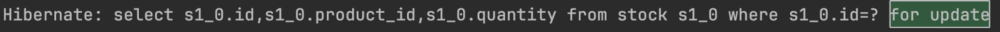

Mysql 을 활용한 다양한 방법

1. **Pessimistic Lock**
    1. 실제로 데이터에 Lock 을 걸어서 정합성을 맞추는 방법입니다. exclusive lock 을 걸게되며 다른 트랜잭션에서는 lock 이 해제되기전에 데이터를 가져갈 수 없게됩니다.

       데드락이 걸릴 수 있기때문에 주의하여 사용하여야 합니다.

       특정 서버가 데이터에 접근할때 exclusive lock을 건다. 다른 서버는 해당 서버가 락을 해제하기 전에는 데이터에 접근 불가. 데이터에는 락을 가진 스레드만 접근 가능하다.

        ```java
        @Lock(LockModeType.PESSIMISTIC_WRITE)
        @Query("select s from Stock s where s.id = :id")
        Stock findByIdWithPessimisticLock(Long id);
        ```

        - JPA에서는 @Lock 어노테이션으로 Pessimistic Lock을 쉽게 구현할 수 있다.

        
       쿼리를 보면 for update 가 있는데 이부분이 락을 걸고 데이터를 가져오는 부분이다.

       장점 :

        - 충돌이 빈번하게 일어나는 상황이면 Optimistic Lock보다 성능이 좋을 수 있다.
        - 락을 통해 업데이트를 제어하기 때문에 데이터 정합성이 보장된다.

       단점 :

        - 별도의 락을 잡기 때문에 성능 감소가 발생할 수 있다.
2. **Optimistic Lock**
    1. 실제로 Lock 을 이용하지 않고 버전을 이용함으로써 정합성을 맞추는 방법입니다. 먼저 데이터를 읽은 후에 update 를 수행할 때 현재 내가 읽은 버전이 맞는지 확인하며 업데이트 합니다. 내가 읽은 버전에서 수정사항이 생겼을 경우에는 application에서 다시 읽은후에 작업을 수행해야 합니다.
    2. 서버1, 2가 동시에 버전이 1인 데이터를 읽어감 → 서버1이 업데이트를 먼저 함 → 업데이트 쿼리를 적용할 때 where 조건에 버전 1을 명시하고, 버전업 → 실제 데이터는 버전 2가 됨 → 서버2가 업데이트를 할때는 버전이 1인 데이터가 없으므로 업데이트 실패 → 서버2는 db에서 데이터를 다시 읽은 후에 update를 수행해야한다

    ```java
    @Version
    private Long version;
    ```

    - Stock 엔티티에 version 컬럼 추가

```java
@Lock(LockModeType.OPTIMISTIC)
@Query("select s from Stock s where s.id = :id")
Stock findByIdWithOptimisticLock(Long id);
```

```java
@Component
public class OptimisticLockStockFacade {

    private final OptimisticLockStockService optimisticLockStockService;

    public OptimisticLockStockFacade(OptimisticLockStockService optimisticLockStockService) {
        this.optimisticLockStockService = optimisticLockStockService;
    }

    public void decrease(Long id, Long quantity) throws InterruptedException {
    		// update가 성공할때까지 retry
        while (true) {
            try {
                optimisticLockStockService.decrease(id, quantity);
                break;
            } catch (Exception e) {
		            // 예외가 발생하면 50 milliseconds 뒤에 다시 시도
                Thread.sleep(50);
            }
        }
    }
}
```

```java
@Test
    void 동시에_100개의_요청() throws InterruptedException {
        int thread = 100;
        ExecutorService executorService = Executors.newFixedThreadPool(32);
        CountDownLatch countDownLatch = new CountDownLatch(thread);

        for (int i = 0; i < thread; i++) {
            executorService.submit(() -> {
                try {
                    optimisticLockStockFacade.decrease(1L, 1L);
                } catch (InterruptedException e) {
                    System.out.println("Error");
                } finally {
                    countDownLatch.countDown();
                }
            });
        }
        countDownLatch.await();
        Stock stock = stockRepository.findById(1L).orElseThrow();
        assertEquals(0, stock.getQuantity());
    }
```

- 장점 : 별도의 락을 잡지 않으므로 Passimistic lock보다 성능이 좋음
- 단점 : 업데이트 실패시 재시도 로직을 직접 개발해야함

충돌이 빈번하게 일어날것이 예상된다면 Pasimistic Lock을 충돌이 빈번하지 않으면 Optimistic Lock을 사용하는 것이 좋다.

1. **Named Lock**
    1. 이름을 가진 metadata locking 입니다. 이름을 가진 lock 을 획득한 후 해제할때까지 다른 세션은 이 lock 을 획득할 수 없도록 합니다. 주의할점으로는 transaction 이 종료될 때 lock 이 자동으로 해제되지 않습니다. 별도의 명령어로 해제를 수행해주거나 선점시간이 끝나야 해제됩니다.
        1. MySQL에서는 get-lock 명령어를 통해 Named Lock을 획득할 수 있고, Release Lock을 통해 Lock을 해제할 수 있다.
        2. 실무에서는 데이터 소스를 분리해서 사용하는 것이 좋다. → 같은 데이터 소스를 사용하면 커넥션 풀이 부족해지는 현상으로 인해 다른 서비스에도 영향을 끼칠 수 있기 때문
    2. Pessimistic Lock과 차이점
        1. Pessimistic Lock은 row나 table 단위로 lock을 걸지만 Named Lock은 메타데이터의 락킹을 하는 방식이다.

```java
// 실무에서는 별도의 JDBC를 구현해서 사용해야한다.
public interface LockRepository extends JpaRepository<Stock, Long> {

    @Query(value = "select get_lock(:key, 3000)", nativeQuery = true)
    void getLock(String key);

    @Query(value = "select release_lock(:key)", nativeQuery = true)
    void releaseLock(String key);
}
```

- Named Lock 획득, 해제를 위해 LockRepository 구현

```java
@Component
public class NamedLockStockFacade {

    private final LockRepository lockRepository;
    private final StockService stockService;

    public NamedLockStockFacade(LockRepository lockRepository, StockService plainStockService) {
        this.lockRepository = lockRepository;
        this.stockService = plainStockService;
    }

    @Transactional
    public void decrease(Long id, Long quantity) {
        try {
		        // lock 획득
            lockRepository.getLock(id.toString());
            stockService.decrease(id, quantity);
        } finally {
			      // 작업 완료하고 lock 해제
            lockRepository.releaseLock(id.toString());
        }
    }
}
```

```java
@Test
    void 동시에_100개의_요청() throws InterruptedException {
        int thread = 100;
        ExecutorService executorService = Executors.newFixedThreadPool(32);
        CountDownLatch countDownLatch = new CountDownLatch(thread);

        for (int i = 0; i < thread; i++) {
            executorService.submit(() -> {
                try {
                    namedLockStockFacade.decrease(1L, 1L);
                    System.out.println("Error");
                } finally {
                    countDownLatch.countDown();
                }
            });
        }
        countDownLatch.await();
        Stock stock = stockRepository.findById(1L).orElseThrow();
        assertEquals(0, stock.getQuantity());
    }
```

- NamedLock은 주로 분산락을 구현할 때 사용한다.
- Pessimistic Lock은 타임아웃을 구현하기 힘들지만 NamedLock은 타임아웃을 쉽게 구현할 수 있고, 데이터 삽입시에 정합성을 맞춰야하는 경우에도 사용할 수 있다.
- 단점은 트랜젝션 종료시에 락해제 및 세션관리, 구현이 복잡할 수 있다.

참고

https://dev.mysql.com/doc/refman/8.0/en/

https://dev.mysql.com/doc/refman/8.0/en/locking-functions.html

https://dev.mysql.com/doc/refman/8.0/en/metadata-locking.html

---