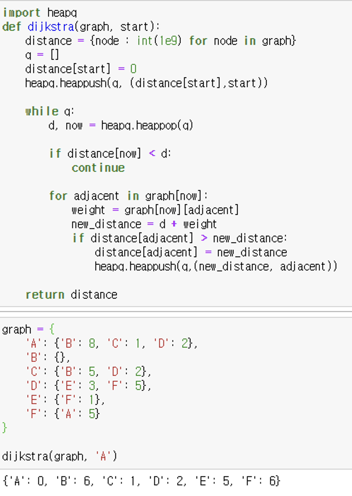
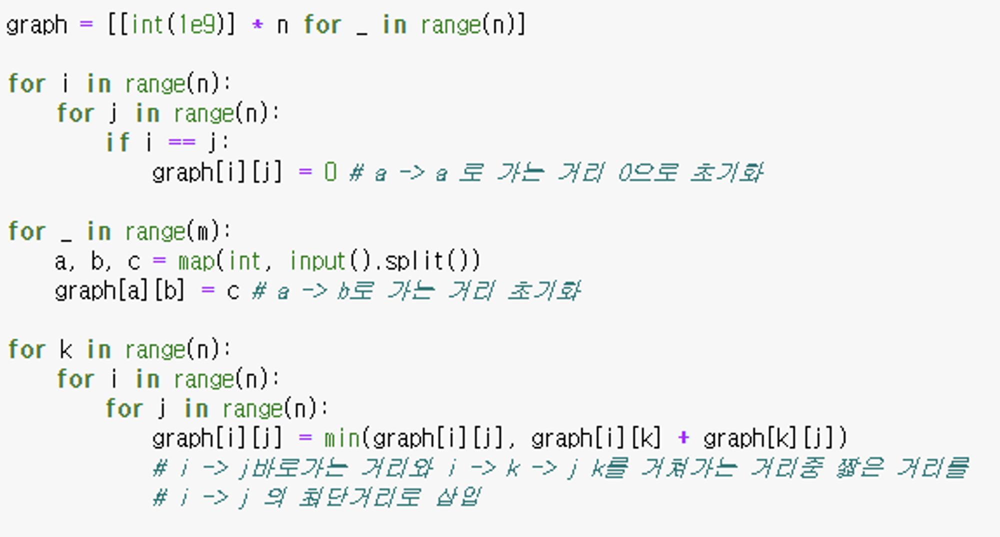

# 1. **최단경로**

- 두 노드를 잇는 가장 짧은 경로
- 가중치 그래프에서 간선의 가중치 합이 최소가 되도록 하는 경로를 찾는 것이 목적
- 다익스트라
  - 한 노드에서 다른 모든 노드까지 최단거리
- 플로이드 워셜 알고리즘
  - 모든 노드에서 다른 모든 노드까지의 최단 거리

# 2. **다익스트라**
- 한 노드에서 다른 모든 노드까지의 최단거리를 구하는 알고리즘
- 우선 순위 큐를 사용해서 구현할 수 있음
- 1차원 리스트에 최단 거리를 저장
- 시간복잡도 : 인접한 노드 탐색(O(E)) + 모든 간선이 추가될때마다(O(E)) * 우선순위큐에서 최단거리 탐색(O(logE)) = O(E) + O(ElogE) = O(ElogE)

   

# 3. **플로이드 워셜**
- 모든 노드에서 다른 모든 노드까지의 최단 거리를 구하는 알고리즘
- 2차원 리스트에 최단거리를 저장
- 시간복잡도는 distance 초기화 O(n^2) + a → b 거리 초기화 O(m) + a → k → b 최단거리를 구하는 3중 포문 (O(n^3)) ⇒ O(n^3)
  
  