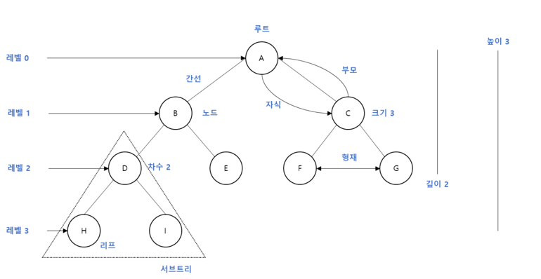

# 트리

### 1. 트리의 속성

- 재귀로 정의된 자기참조 자료구조
- 트리는 자식도 트리이고 자식의 자식도 트리 -> 즉, 여러개의 서브트리로 구성되어 있다.

### 2. 트리의 각 명칭

- 간선(degree) : 노드 사이를 잇는 선
- 높이(height) : 현재 위치에서부터 리프까지의 거리
- 깊이(depth) : 루트에서부터 현재 노드까지의 거리
- 레벨은 0에서부터 시작하는 것이 일반적이다.
- 트리는 항상 단방향이다.

### 3. 그래프와 트리의 차이점
- **트리는 순환 구조를 갖지 않는 그래프이다.**
- 그래프 
  - 단방향, 양방향을 모두 가리킬 수 있음
- 트리
  - 부모노드 -> 자식노드를 가리키는 단방향뿐이다.
  - 하나의 부모 노드를 갖음
  - 루트도 하나

### 4. 이진 트리
- 트리 중에서 가장 널리 사용되는 트리 자료구조
  - 이진트리, 이진 탐색 트리
- 다항트리 : 노드가 m개 이하의 자식을 갖고 있으면 m-ary 트리라고 한다
- 이진 트리
  - 다항 트리에서 m = 2일 경우, 즉 모든 노드의 차수가 2 이하일때 이진 트리라고 한다
  - 이진트리는 왼쪽, 오른쪽 최대 2개의 자식을 갖는 매우 단순한 형태의 트리로 다항 트리보다 훨씬 간결하다. 
  - 정 이진 트리 (Full Binary Tree) : 모든 노드가 0개 또는 2개의 자식 노드를 갖음
  - 완전 이진 트리(Complete Binary Tree) : 마지막 레벨을 제외하고 모든 레벨이 완전히 채워져 있으며, 마지막 레벨의 모든 노드는 가장 왼쪽부터 채워져 있음
  - 포화 이진 트리(Perfect Binary Tree) : 모든 노드가 2개의 자식노드를 갖고 있으며, 모든 리프노드가 동일한 깊이 또는 레벨을 갖고 있다
  