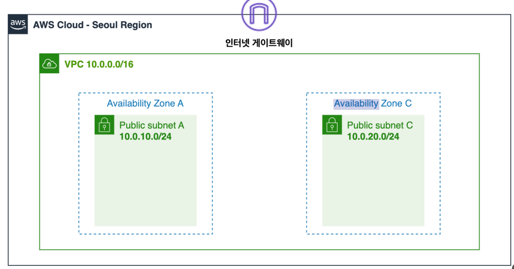
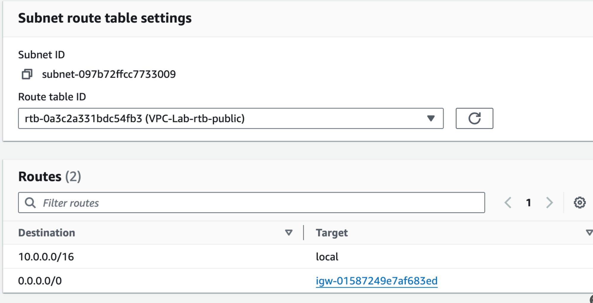
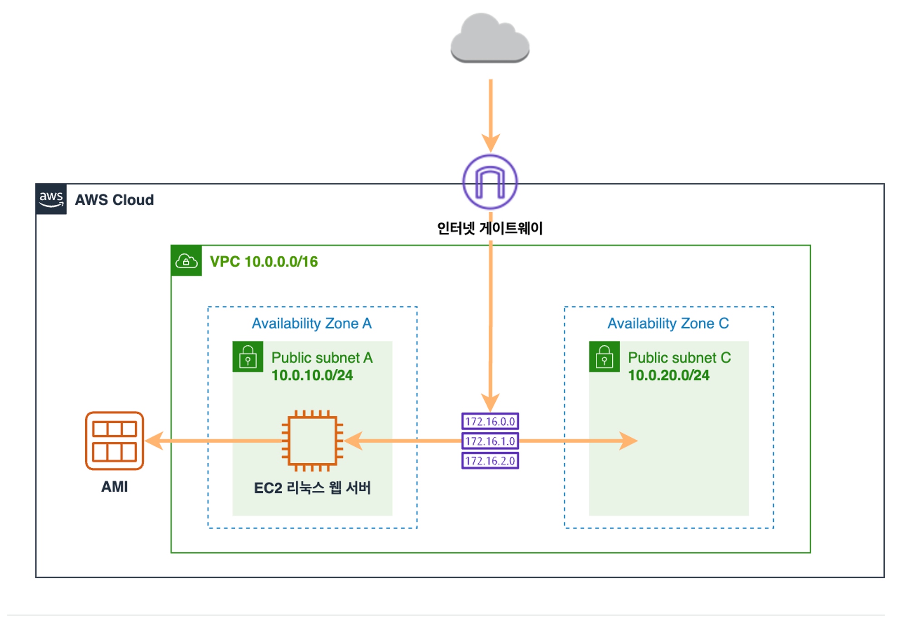

## 네트워크 구성

### VPC란?

---

- Virtual Private Cloud
- 사용자가 서비스할 가상의 네트워크 공간 (AWS 에서 제공하는 네트워크 인프라)
    - 고객이 AWS 클라우드 내에서 자체 가상 네트워크를 구축하고 관리할 수 있게 해준다. (클라우드 환경에서 네트워킹)
    - VPC는 클라우드 환경에서의 네트워킹을 관리하기 위한 도구 -> 온프레미스 환경에서는 하드웨어 구매, 설치, 보안, 백업, 복구를 모두 직접 처리해줘야하지만 AWS vpc 를 이용하면 AWS가 대신 다 해준다.
- 한 VPC 내에 복수 개의 가용영역 AZ(데이터 센터)를 둔다.
    - AZ : 물리적인 개념, aws의 데이터 센터이다. 각 가용영역은 지리적으로 서로 다른 곳에 위치해있고, 전원공급 및 네트워크도 독립적으로 가지고 있다. -> 그래서 한 가용영역에 장애가 발생했을 때 다른 가용영역으로 서비스를 이전해서 고가용성을 제공할 수 있는 것
    - 서브넷 : 논리적인 개념. vpc 내에서 네트워크를 더 작은 단위로 분할하는데 사용한다. 각 서브넷에는 서로 다른 CIDR 블록 (IP주소 범위)이 할당된다.
    - VPC 내의 AZ, 서브넷, EC2 인스턴스
        - 서브넷은 특정 AZ 내에 생성되고, 해당 AZ의 물리적 리소스를 사용해서 서비스를 제공한다. 서브넷은 할당받은 CIDR 블록을 통해 IP 주소 범위를 정의하고, 서브넷 내의 인스턴스들은 이 범위내에서 IP 주소를 할당 받는다.
    - CIDR 주소 범위 이해하기
        - Classless Inter-Domain Routing
        - 네트워크의 주소와 크기를 표현하는 방식
        - VPC CIDR : 10.0.0.0/16
            - 16을 서브넷 값으로 하는 IP 주소 범위
            - 각 자원에 줄 수 있는 IP 갯수 : 2^16
            - 서브넷 마스크는 첫 16비트가 1로 설정된 2진형태(첫 16비트는 네트워크,나머지 16비트는 호스트 주소)
            - 11111111.11111111.00000000.00000000
            - 그래서 16비트의 서브넷 마스크는 총 2^16 개의 ip 주소를 할당할 수 있음
            - 그러나 10.0.0.0은 네트워크 주소로 10.0.255.255는 브로드캐스트 주소로 예약돼있으므로 실제 사용가능한 IP 주소는 2^16 - 2개
        - 서브넷 마스크를 사용해서 네트워크 주소와 호스트 주소 추출하는 예시
            - IP 주소 : 192.168.1.100
            - 서브넷 마스크 : 255.255.255.0 (CIDR로 24 앞에서부터 8비트*3가 1임)
            1. IP 주소와 서브넷마스크 2진수로 변환
                - IP 주소: 11000000.10101000.00000001.01100100
                - 서브넷 마스크: 11111111.11111111.11111111.00000000
            2. And 연산으로 네트워크 주소 추출

                ```
                
                IP 주소:     11000000.10101000.00000001.01100100
                서브넷 마스크: 11111111.11111111.11111111.00000000
                --------------------------------------------------------
                네트워크 주소: 11000000.10101000.00000001.00000000 (192.168.1.0)
                
                남는 비트는 호스트 주소
                
                호스트 주소:     00000000.00000000.00000000.01100100 (0.0.0.100)
                
                ```


### VPC를 사용하는 이유

---

- 네트워크 분리 및 보안 강화
    - VPC를 여러 서브넷으로 분할하여 각 서브넷마다 다른 보안 정책을 적용할 수 있다. -> 논리적으로 네트워크를 분리함으로써 보안을 강화할 수 있다.
- 사용자가 원하는 IP 주소 범위를 정의할 수 있다.
- 스케일링 및 유연성
    - VPC를 사용하면 필요에 따라 네트워크를 확장하거나 축소할 수 있다. 다른 AWS 서비스와 통합해서 사용도 가능하다
- 지리적 확장성
    - VPC는 다양한 지역과 가용영역에서 제공되므로 지리적으로 분산된 사용자 또는 고객에게 빠르고 안정적인 서비스를 제공할 수 있다.

### 추가 서브넷 생성하기

- 고가용성을 확보하기 위해, 다중 가용영역에 서비스를 배포하는 것이 중요하다. 앞에서 생성한 서브넷이 위치한 가용영역 A 이외에 다른 가용영역에 서브넷을 추가로 생성한다.
- ==가용영역이 서로 달라도 서브넷의 CIDR 블록은 서로 겹치면 안된다==
    - 예를 들면, VPC의 CIDR 범위가 10.0.0.0/16이고
      가용영역 a에 생성된 서브넷의 CIDR블록 범위가 10.0.10.0/24 이라면
      가용영역 c에 추가로 생성하려고 하는 서브넷의 CIDR블록을 10.0.10.0/24으로 생성하면 IP 충돌이 발생한다.

아키텍쳐 구성



### 라우팅 테이블 편집하기

---

라우팅 테이블에는 서브넷 또는 게이트웨이의 ==네트워크 트레픽이 전송되는 위치를 결정하는데 사용되는 라우팅이라는 규칙 집합==이 포함되어 있다.

- 사용자 지정 라우팅 테이블을 생성하지 않으면 VPC를 생성할때 자동으로 default 라우팅 테이블이 생성된다.
- 사용자 정의 라우팅 테이블에서 인터넷 게이트웨이로 향하는 경로가 있는지 확인하는 방법
    - target이 인터넷 게이트웨로 표시되는지 확인
    - 인터넷으로 향하는 경로가 있는 경우 VPC내의 모든 트래픽은 해당 인터넷 게이트웨이를 통해 인터넷으로 라우팅 된다.

  

    - 10.0.0.0/16, target : local -> VPC 내부의 다른 리소스로 이동할 때
        - 즉 같은 VPC 내의 서브넷 간의 통신을 처리하거나, 같은 VPC 내의 인스턴스 간의 통신을 처리하는데 사용됨
    - 0.0.0.0/16 은 모든 IP 주소, 즉 모든 트래픽을 대상으로 함
        - 모든 트래픽을 igw 로 보내도록 구성이 되어 있음
        - 즉, VPC 내의 인스턴스가 외부 네트워크 또는 인터넷과 통신하려고 할 때 사용됨
        - 이 라우팅 항목을 통해 인스턴스에서 생성된 모든 아웃바운드 트래픽이 인터넷으로 전달되고 외부에서 생성된 인바운드 트래픽이 해당 VPC 내의 인스턴스로 전달 됨

### 보안그룹 생성하기

---

- 보안그룹 : 인스턴스에 대한 아웃바운드와 인바운드 트래픽을 제어하는 가상 방화벽
- type : 네트워크 프로토콜 타입 (ssh, http)
- destination : 해당 하는 ip 주소만 인스턴스에 접근을 허용한다.

### 웹서버 생성

---

### 웹서버 인스턴스 생성하기

---

### AMI

- 인스턴스를 시작하는데 필요한 정보를 제공한다. 인스턴스를 시작할 때 AMI를 지정해야하는데 동일한 구성의 인스턴스가 여러개 필요할때는 한 AMI를 사용해서 여러 인스턴스를 시작할 수 있다. -> 이미 생성된 인스턴스의 이미지를 떠놓을 수도 있다

현재 아키텍쳐 구성



### 로드밸런서 구성

### ELB

---

애플리케이션 트래픽을 여러 대상에 자동으로 분산시킨다.
ELB가 제공하는 로드밸런서

- Application Load Balancer
- Network Load Balancer
- Gateway Load Balancer
- Classic Load Balancer