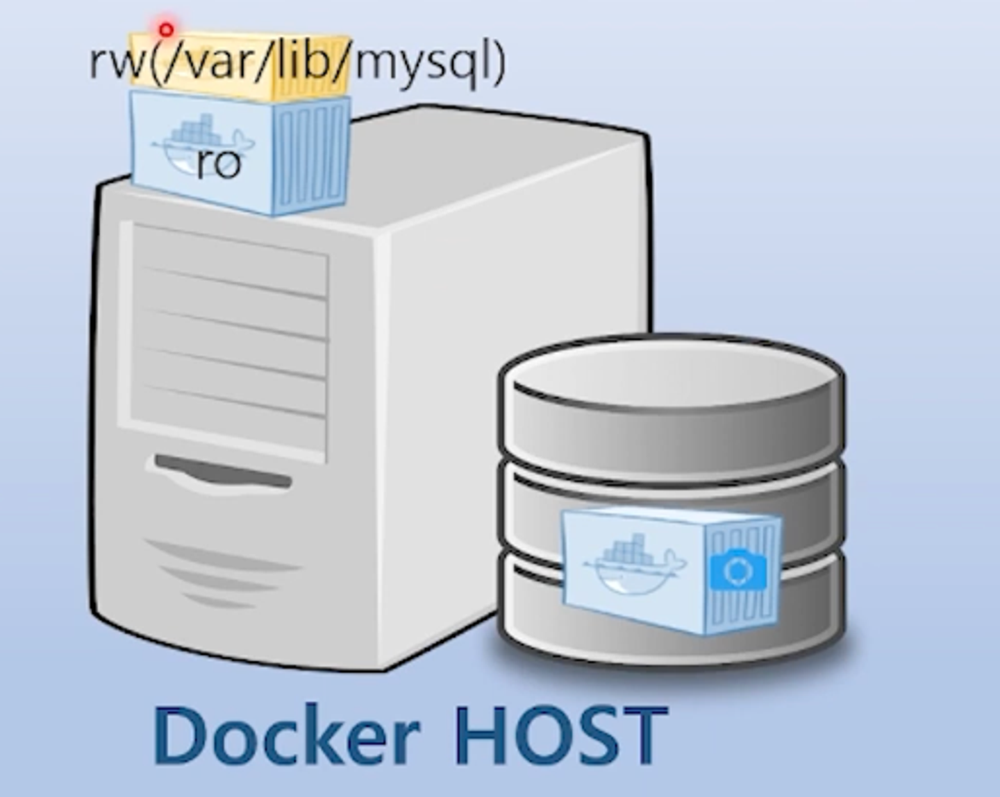
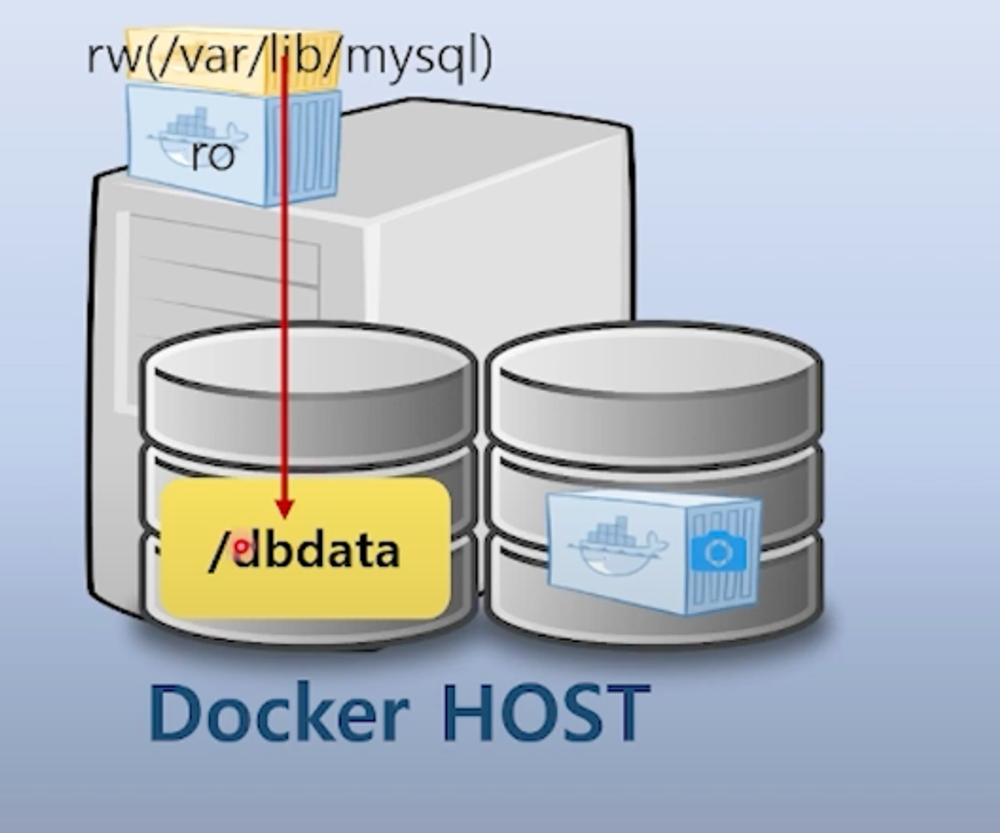
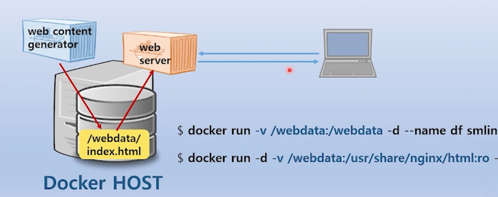

# Container Storage

## Container volume

- 컨테이너 이미지 = read only
- 컨테이너 이미지 → docker run → 이미지가 프로세스가 되어 동작 → rw 레이어 생성(Union file system 구조로 동작, overlay)
- 컨테이너에 추가되는 데이터들은 별도의 RW 레이어에 저장
    - 예) Mysql 컨테이너를 도커로 띄우면 저장되는 고객 데이터는 rw 레이어에 저장된다.
    - Docker 컨테이너 삭제 → rw레이어에 쌓여있던 고객 데이터는 어디에? → 컨테이너와 같이 삭제돼서 복구 불가임 → 그래서 컨테이너 볼륨(데이터) 저장이 중요

## 컨테이너가 만들어주는 데이터 영구적 보존하기



- 데이터를 보존하려면 도커 호스트에 특정 저장소공간을 만들어야 함
- 컨테이너가 만든 데이터를 디스크에 저장



```bash
docker run -d --name db
-v /dbdata:/var/lib/mysql # -v 호스트의 디렉토리:컨테이너 디렉토리
-e MYSQL_ALLOW_EMPTY_PASSWORD=pass
mysql:latest
```

- 볼륨 마운트 : 디스크 안에는 dbdata라는 폴더가 존재 → 컨테이너 디렉토리에 쌓이는 데이터가 실제 디스크의 dbdata폴더에 쌓이게 됨

```bash
-v [hostpath]:[container mount path]
-v [hostpath]:[container mount path]:[read write mode]
-v [container mount path]
```

- 예시

```bash
docker run -d -v /dbdata:/var/www/html:ro
docker run -d -v /var/lib/mysql
```

## 컨테이너간 데이터 공유하기



- 리눅스 컨테이너에서 web 콘텐츠 생성 → 생성된 컨텐츠를 우분투 컨테이너에서 클라이언트에게 서비스
- 볼륨 마운트를 통해 컨테이너간 데이터 공유가 가능하다