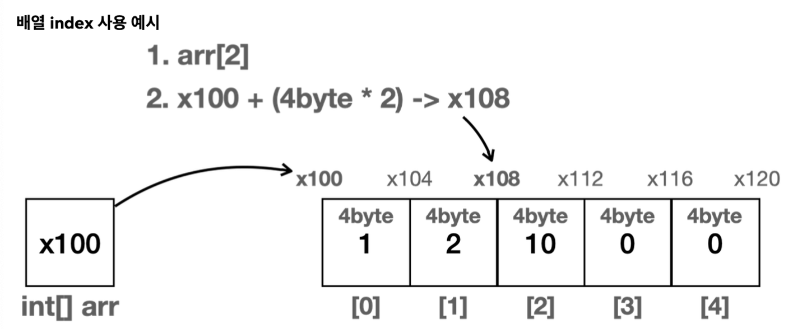
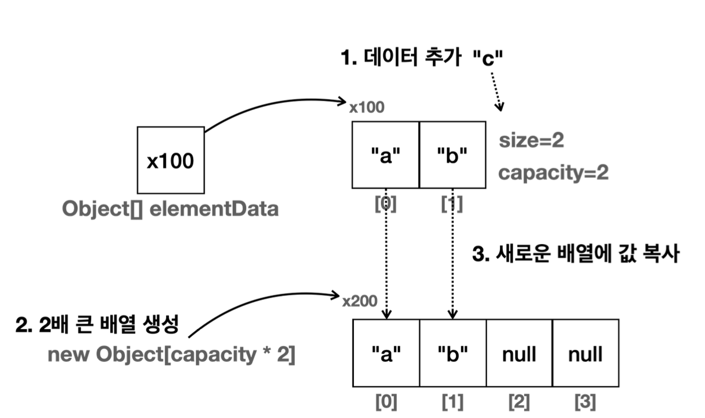
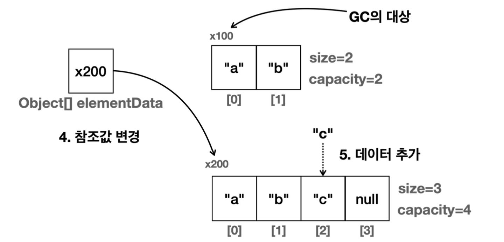

# 컬렉션 프레임워크 - ArrayList
## 배열



- 배열은 메모리상에 순서대로 붙어서 존재한다.
- int = 4byte
- 배열의 시작위치인 x100부터 시작해서 자료크기 4byte와 인덱스 곱하면 = 메모리 위치
- 예) arr[2]에 위치한 자료를 찾기
    - 배열의 시작 참조(x100) + 자료의 크기 (4byte) * 인덱스 위치(2) = x108
- 공식:`배열의 시작 참조 + (자료의 크기 * 인덱스 위치)`
- 배열에서 인덱스를 사용하는 경우 데이
  터가 아무리 많아도 **한 번의 연산으로 필요한 위치를 찾을 수 있다.**

## **배열에 데이터를 추가할 때 위치에 따른 성능 변화**

- 배열의 첫번째 위치에 추가
    - 배열의 첫번째 위치를 찾는데 걸리는 시간 =  O(1)
    - 모든 데이터를 배열의 크기만큼 한 칸씩 이동하는 데 걸리는 시간 = O(n)
    - O(1 + n) → O(n)
- 배열의 중간 위치에 추가
    - 배열의 첫번째 위치를 찾는데 걸리는 시간 =  O(1)
    - index의 오른쪽에 있는 데이터를 모두 한 칸씩 이동하는 평균 연산 = O(n/2)
    - O(1 + n/2) → O(n)
- 배열의 마지막 위치에 추가
    - 이 경우 배열이 이동하지 않고 배열의 길이를 사용하면 마지막 인덱스에 바로 접근할 수 있으므로 한번의 계산으로 위치를 찾을 수 있고, 기존 배열을 이동하지 않으므로 O(1)이 된다.

## 배열의 단점

- 배열을 생성하는 시점에 크기를 미리 정해야함 → 길이를 동적으로 늘릴 수 없음
- 데이터 추가가 불편함
    - 데이터를 추가하는 경우 오른쪽으로 데이터를 한칸씩 밀어야함

## List

- 동적으로 데이터를 추가할 수 있음
- 순서가 있고 중복을 허용하는 자료구조

### 배열에 새로운 값을 추가 - 인덱스 값이 배열의 길이를 초과할 때





- Arrays.copyOf(기존배열, 새로운길이) 를 사용해서 2배 큰 배열을 새로 생성하면서 동시에 새로운 배열에 기존 배열의 값을 복사하고, 참조값을 변경한다.
- 기존 배열( `x100` )은 더는 참조하는 곳이 없으므로 GC의 대상이 된다
- JAVA에서 보통은 size가 50% 정도 증가하는걸로 구현되어 있다.

### 얕은 복사?

- 객체나 배열 내부에 있는 요소들이 복사될 때, 원본과 복사본이 어떻게 참조 관계를 유지하는지에 따라 달라진다.
1. 얕은 복사
    - 객체의 참조 값만 복사하는 방식
    - 복사된 객체는 원본 객체와 동일한 참조값을 가짐 → 복사본과 원본이 같은 객체를 참조
    - 얕은 복사 방식
        - primitive type : 값을 복사
        - 참조형 타입 : 참조 값을 복사
    - 복사본과 원본은 다른 객체지만, 참조형 필드가 같은 객체를 가리키므로 한쪽에서 참조형 데이터를 수정하면 다른 쪽에서도 영향을 받는다.
    - 얕은 복사를 수행하는 메서드 : Object.clone(), Arrays.copyOf() 메서드

## 제네릭

- 제네릭을 도입하면 타입 안전성을 확보하면서, 하나의 타입만 보관함을 보장할 수 있다.

```java
package org.example.collections.array;

import java.util.Arrays;

public class MyArrayListV1<E> {
    private static final int DEFAULT_CAPACITY = 5;

    private Object[] elems;
    private int size = 0;

    public MyArrayListV1() {
        elems = new Object[DEFAULT_CAPACITY];
    }

    public MyArrayListV1(int initialCapacity) {
        elems = new Object[initialCapacity];
        this.size = initialCapacity;
    }

    public void add(E o) {
        if (size == elems.length) {
            elems = Arrays.copyOf(elems, elems.length * 2); // 길이 두배로 늘림
        }
        elems[size] = o;
        size++;
    }

    public void add(int index, E o) {
        if (size == elems.length) {
            elems = Arrays.copyOf(elems, elems.length * 2); // 길이 두배로 늘림
        }
        shiftRightFrom(index);
        elems[index] = o;
        size++;
    }

    private void shiftRightFrom(int index) {
        for (int i = size; i > index; i--) {
            elems[i] = elems[i-1];
        }
    }
    
    public Object remove(int index) {
        Object o = get(index);
        shiftLeftFrom(index);
        size--;
        return o;
    }

    private void shiftLeftFrom(int index) {
        for (int i = index; i < size; i++) {
            elems[i] = elems[i+1];
        }
    }

    public E get(int index) {
        return (E) elems[index];
    }

    public E set(int index, E elem) {
        E oldValue = this.get(index);
        elems[index] = elem;
        return oldValue;
    }

    public int indexOf(E o) {
        for (int i = 0; i < size; i++) {
            if (o.equals(elems[i])) {
                return i;
            }
        }
        return -1;
    }

    @Override
    public String toString() {
        return "MyArrayListV1{" +
                "elems=" + Arrays.toString(Arrays.copyOf(elems, size)) + // Arrays.copyOf(elems, size) : size 크기의 배열을 새로 만듬
                ", size=" + size +
                ", capacity=" + elems.length +
                '}';
    }
}

```

- `private Object[] elems;` 은 그대로 유지
    - 제네릭은 런타임에 의해 타입 정보가 사라짐 → 런타임에 타입 정보가 필요한 생성자에 사용할 수 없음 → 제네릭을 기반으로 배열을 생성하면 컴파일 에러 발생함
        - `new E[3];`
- `new MyArrayList<String>` 을 사용한 경우 E가 다음과 같이 처리됨
    - 제네릭 타입 인자 적용 후

    ```java
    Object[] elems;
    
    void add(String e) { // String(E) 타입으로만 저장
    ...
    }
    
    String get(int index) {
    	return (String) elems[index]; // 다운캐스팅
    }
    ```

    - Object는 모든 데이터를 담을 수 있기 때문에 데이터를 담는데는 아무런 문제가 없다. 데이터를 조회할 떄 문제가 될 수 있는데, 이때는 조회한 Object 타입을 지정한 타입 매개변수로 다운캐스팅 해준다.
- 생성자에는 제네릭 타입 매개변수를 사용할 수 없는 한계가 있음.
- 배열을 생성할 때 대안으로 Object배열을 사용해야함 → but, 제네릭이 리스트의 데이터를 입력 받고 반환하는 곳의 타입을 고정해준다. → 고정된 타입으로 Object 배열에 데이터를 보관하고, 데이터를 꺼낼때도 같은 고정된 타입으로 안전하게 다운 캐스팅 가능

## ArrayList의 단점

- 정확한 크기를 미리 알지 못하면 메모리가 낭비된다.
    - 배열을 사용하므로 배열 뒷부분의 빈공간은 낭비되는 메모리
- 데이터를 중간에 추가하거나 삭제할 떄 비효율적이다.
    - 데이터를 한칸씩 밀어야 하므로 O(n)으로 성능이 좋지 않음
- ArrayList의 빅오 정리
    - 데이터 추가
        - 마지막에 추가 : O(1)
        - 앞, 중간 추가 : O(n)
    - 데이터 삭제
        - 마지막에 삭제 : O(1)
        - 앞, 중간에 삭제 : O(n)
    - 인덱스 조회 : O(1)
    - 데이터검색 : O(n)