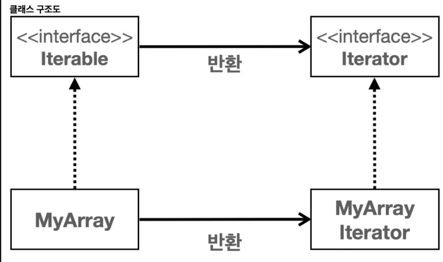
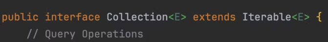
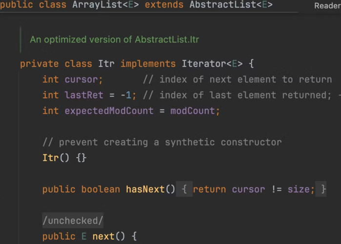

> **Iterator (반복자) 디자인 패턴**은 객체 지향 프로그래밍에서 컬렉션의 요소들을 순회할 때 사용되는 디자인패턴이다. 이 패턴은 컬렉션의 내부 표현 방식을 노출시키지 않으면서도 그 안의 각 요소에 순차적으로 접근할 수 있게 해준다. Iterator 패턴은 컬렉션의 구현과는 독립적으로 요소들을 탐색할 수 있는 방법을 제공하며, 이로 인해 코드의 복잡성을 줄이고 재사용성을 높일 수 있다.
>

## Iterable, Iterator

- `Iterable` : 반복가능한
- `Iterator` : 반복자

## **Iterable 인터페이스의 주요 메서드**

```java
 public interface Iterable<T> {
     Iterator<T> iterator();
```

- 단순히 `Iterator` 반복자를 반환한다.

## **Iterator 인터페이스의 주요 메서드**

```java
 public interface Iterator<E> {
     boolean hasNext();
     E next();

```

- `hasNext()` : 다음 요소가 있는지 확인한다. 다음 요소가 없으면 `false` 를 반환한다.
- `next()` : 다음 요소를 반환한다. 내부에 있는 위치를 다음으로 이동한다.

## Iterator 구현체

```java
package org.example.collections.iterable;

import java.util.Iterator;

public class MyArrayIterator implements Iterator<Integer> {

    private int currentIndex = -1; // next index = 0
    private int[] targetArr;

    public MyArrayIterator(int[] targetArr) {
        this.targetArr = targetArr;
    }

    @Override
    public boolean hasNext() {
        return currentIndex < targetArr.length - 1;
    }

    @Override
    public Integer next() {
        return targetArr[++currentIndex];
    }
}
```

- Iterator는 단독으로 사용불가

```java
package org.example.collections.iterable;

import java.util.Iterator;

public class MyArray implements Iterable<Integer> {
    private int[] nums;

    public MyArray(int[] nums) {
        this.nums = nums;
    }

/**
  - iterable 인터페이스 구현
  - 반복자인 MyArrayIterator 반환
  - MyArrayIterator는 생성자를 통해 MyArray 내부 배열인 nums 참조
**/
    @Override
    public Iterator<Integer> iterator() {
        return new MyArrayIterator(nums);
    } 
}

```



- Iterable 인터페이스 구현하려면, iterator 메서드를 구현해야한다.
- iterator()는 Iterator 인터페이스를 구현한 반복자를 반환한다.



- Collection 인터페이스가 Iterable 을 상속받고 있으므로 Java가 제공하는 컬렉션 프레임워크의 모든 자료구조는 Iterable과 Iterator를 사용해서 편리하고 일관된 방법으로 순회 가능

```java
public class JavaIterableMain {

    public static void main(String[] args) {
        ArrayList<Integer> list = new ArrayList<>();
        list.add(1);
        list.add(2);
        list.add(3);
        printAll(list.iterator());

        Set<Integer> set = new HashSet<>();
        set.add(1);
        set.add(2);
        set.add(3);
        printAll(set.iterator());
    }

    private static void printAll(Iterator<Integer> iterator) {
        System.out.println(iterator);
        while (iterator.hasNext()) {
            System.out.println(iterator.next());
        }
    }
    
    private static void forEach(Iterable<Integer> iterable) {
        System.out.println(iterable.getClass());
        for (Integer i : iterable) {
            System.out.println(i);
        }
    }
}
```

- printAll(), forEach() 메서드는 새로운 자료 구조가 추가되더라도 Iterable, Iterator만 구현하고 있다면 코드 변경 없이 사용가능하다.
- 이렇게 Iterator, Iterable를 인터페이스로 구현함으로써(다형성), 재사용성이 극대화된다.
- 각 자료구조 별로 각자 구현한 `Iterator` 구현체를 반환한다.

```
> Task :JavaIterableMain.main()
class java.util.ArrayList$Itr
1
2
3
class java.util.HashMap$KeyIterator
1
2
3
```

- Itr은 ArrayList의 중첩클래스이다.


- `HashMap$KeyIterator` : `HashSet` 자료 구조는 사실은 내부에서 `HashMap` 자료 구조를 사용한다. `HashMap` 자료 구조에서 `Value` 를 사용하지 않으면 `HashSet` 과 같다.

- Iterable 인터페이스 구현하려면, iterator 메서드를 구현해야한다.
- iterator()는 Iterator 인터페이스를 구현한 반복자를 반환한다.


- Collection 인터페이스가 Iterable 을 상속받고 있으므로 Java가 제공하는 컬렉션 프레임워크의 모든 자료구조는 Iterable과 Iterator를 사용해서 편리하고 일관된 방법으로 순회 가능

```java
public class JavaIterableMain {

    public static void main(String[] args) {
        ArrayList<Integer> list = new ArrayList<>();
        list.add(1);
        list.add(2);
        list.add(3);
        printAll(list.iterator());

        Set<Integer> set = new HashSet<>();
        set.add(1);
        set.add(2);
        set.add(3);
        printAll(set.iterator());
    }

    private static void printAll(Iterator<Integer> iterator) {
        System.out.println(iterator);
        while (iterator.hasNext()) {
            System.out.println(iterator.next());
        }
    }
    
    private static void forEach(Iterable<Integer> iterable) {
        System.out.println(iterable.getClass());
        for (Integer i : iterable) {
            System.out.println(i);
        }
    }
}
```

- printAll(), forEach() 메서드는 새로운 자료 구조가 추가되더라도 Iterable, Iterator만 구현하고 있다면 코드 변경 없이 사용가능하다.
- 이렇게 Iterator, Iterable를 인터페이스로 구현함으로써(다형성), 재사용성이 극대화된다.
- 각 자료구조 별로 각자 구현한 `Iterator` 구현체를 반환한다.


- Itr은 ArrayList의 중첩클래스이다.


- `HashMap$KeyIterator` : `HashSet` 자료 구조는 사실은 내부에서 `HashMap` 자료 구조를 사용한다. `HashMap` 자료 구조에서 `Value` 를 사용하지 않으면 `HashSet` 과 같다.