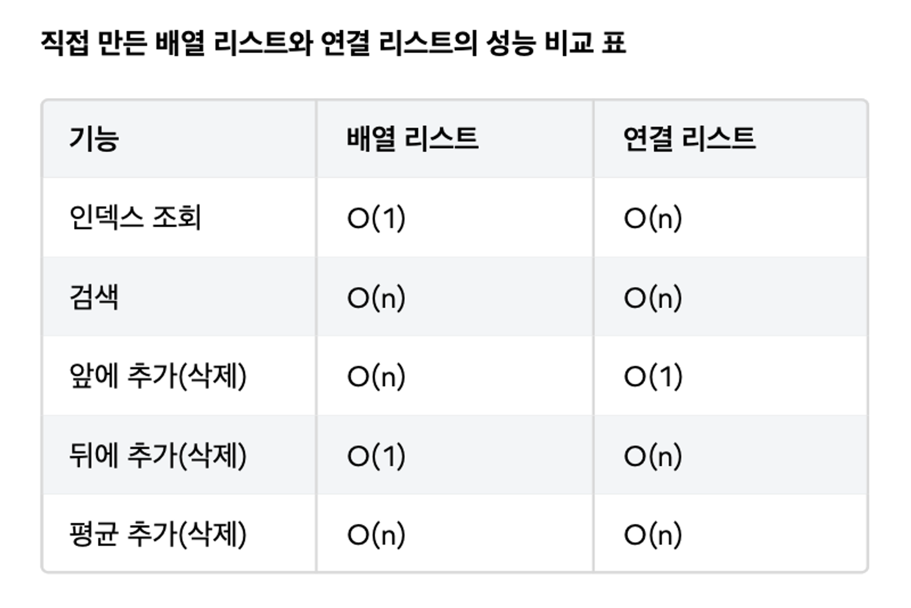

## 연결리스트와 빅오

- 배열은 인덱스로 원하는 데이터를 바로 찾을 수 있음 → 배열을 사용하는 ArrayList로 인덱스로 데이터 조회시 O(1)로 빠른 성능을 보장
- 반면, LinkedList는 배열을 사용하지 않으므로 원하는 index의 데이터를 찾으려면 index만큼 반복해서 찾아야하므로 특정 위치의 노드를 찾는데는 O(n)이 걸린다.

## 연결리스트의 장점과 단점

- 노드를 특정 위치에 추가, 삭제하는 데는 O(1)이 걸림
    - 그러나, 특정 위치 노드를 찾는데는 O(1)가 걸림
    - 첫번째나 마지막 위치에 추가 또는 삭제는 O(1)이 걸리지만, 중간에 노드를 추가, 삭제하는 것은 O(n)이 걸림
    - ArrayList와 동일하게 중간에 노드를 추가하면 O(n)이 걸림

## 배열 리스트와 연결리스트의 성능 비교

- 배열 리스트:
    - 추가 : 데이터를 앞쪽에 추가하는 경우 모든 데이터를 오른쪽으로 한 칸씩 밀어야 한다. O(n)
    - 조회 : 인덱스로 마지막 위치를 바로 찾을 수 있다. O(1)
- 연결 리스트:
    - 추가 : 데이터를 앞쪽에 추가하는 경우 일부 노드의 참조만 변경하면 된다. O(1)
    - 조회 : O(n)
- **배열 리스트 vs 연결 리스트 사용**
  데이터를 조회할 일이 많고, 뒷 부분에 데이터를 추가한다면 배열 리스트가 보통 더 좋은 성능을 제공한다. 앞쪽의 데이터를 추가하거나 삭제할 일이 많다면 연결 리스트를 사용하는 것이 보통 더 좋은 성능을 제공한다.
- 자바가 제공하는 연결리스트
    - 이중 연결 리스트
        - 노드를 앞뒤로 연결 하는 리스트로 단일 연결 리스트보다 성능이 좀더 개선됨