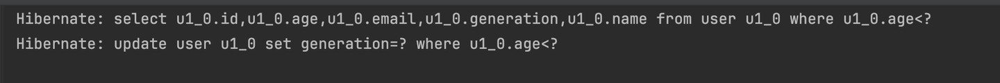

# @Modifying?

---

- JPA에서 사용되는 Annotation으로 @Query로 작성된 변경이 동반되는 쿼리를 실행할 때 사용된다.(INSERT, DELETE, UPDATE)

```
Queries that require a `@Modifying` annotation include INSERT, UPDATE, DELETE, and DDL statements.
```

- JpaRepository에서 제공하는 메서드나 메서드 네이밍으로 생성된 쿼리에는 적용되지 않는다.
- 주로 벌크 연산에 사용된다.
    - 벌크 연산이란?
        - 단 건 변경이 아니라, 여러 데이터를 한번에 변경하는 작업

```java
public interface UserRepository extends JpaRepository<User, Long> {

    @Modifying
    @Query("update User u set u.generation = :generation where u.age < :age")
    int updateByAge(@Param("age") int age, @Param("generation") String generation);

    List<User> findAllByAgeIsLessThan(int age);
}

@Slf4j
@Service
@Transactional
@RequiredArgsConstructor
public class UserServiceImpl implements UserService {

    private final UserRepository userRepository;

    @Override
    public List<User> bulkUpdate(int age) {
		    // 0. 1차 캐시에 user 엔티티 저장. user.generation == "X"
        List<User> users = userRepository.findAllByAgeIsLessThan(30); 
        // 1. X -> MZ 업데이트 쿼리 실행
        userRepository.updateByAge(age, "MZ"); 
        // 2. 1차 캐시에는 반영 안됨
        users.forEach(user -> {
            log.info("user : {}", user);
        });
        return users;
    }
}

```



- 1번에서 1차 캐시를 무시하고 쿼리 실행 → 영속성 컨텍스트에 반영되지 않음
- 2번에서는 1차 캐시의 user.generation 값은 그대로 “X”

```text
Hibernate: select u1_0.id,u1_0.age,u1_0.email,u1_0.generation,u1_0.name from user u1_0 where u1_0.age<?
Hibernate: update user u1_0 set generation=? where u1_0.age<?
2024-07-17T23:20:01.783+09:00  INFO 4826 --- [    Test worker] c.example.demo.service.UserServiceImpl   : user : User(id=2, name=swim, age=20, email=swim@email.com, generation=X)
```

# @Modifying 사용할 때 주의점

---

- 벌크 연산 시 1차 캐시를 무시하고 쿼리를 바로 실행하기 때문에 영속성 컨텍스트의 1차 캐시와 DB의 데이터 싱크가 안맞게 된다.
    - @Query + @Modifying으로 쿼리를 실행하고 나서 다시 변경된 필드를 사용하게되면 1차 캐시에는 변경전 값이 남아 있으므로 문제가 발생한다.

# 해결 방법?

---

- `clearAutomatically=true` 속성을 사용해서 쿼리 실행후 자동으로 영속성 컨텍스트를 초기화한다.
    - 영속성 컨텍스트를 초기화하면, 조회시 1차 캐시에 해당 엔티티가 존재하지 않으므로 DB에서 새로 조회해온다.