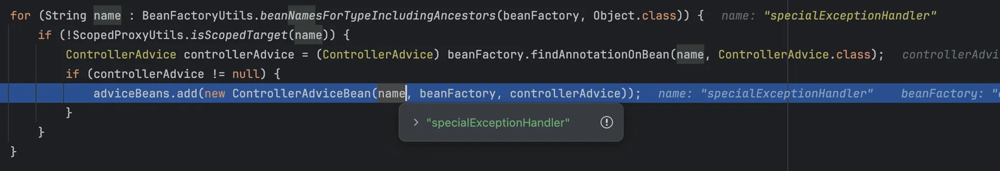
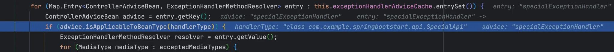
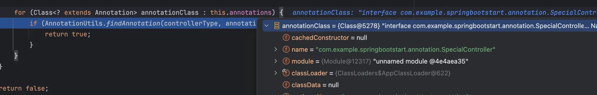

# @RestControllerAdvice의 annotations 속성으로 특정 컨트롤러에만 예외 핸들러 적용하기


@RestControllerAdvice 의 annotations 속성 사용해서 특정 어노테이션이 붙은 Controller에서 발생한 예외를 특정 ExceptionHandler가 처리하게 만들어보자.

다음은 annotation 속성을 적용한 예제코드와 예제 테스트코드이다.

먼저 특정 Controller에 적용할 annotation이다.

```java
@Target(ElementType.TYPE)
@Retention(RetentionPolicy.RUNTIME)
public @interface SpecialController {
}
```

@SpecialController 어노테이션은 SpecialApi controller에만 적용했고, 두 Controller 모두 exceptionInvoker.throwIllegalArgumentException(); 에서 IllegalArgumentException을 throw 하게 했다.

```java

@RestController
@SpecialController
@RequestMapping("/api/special")
public class SpecialApi {

    private static final Logger logger = LoggerFactory.getLogger(SpecialApi.class);

    private final ExceptionInvoker exceptionInvoker;

    public SpecialApi(ExceptionInvoker exceptionInvoker) {
        this.exceptionInvoker = exceptionInvoker;
    }

    @GetMapping
    public String index() {
        logger.info("SpecialApi index");
        exceptionInvoker.throwIllegalArgumentException();
        return "ok";
    }
}

@RestController
@RequestMapping("/api/normal")
public class NormalApi {

    private static final Logger logger = LoggerFactory.getLogger(NormalApi.class);

    private final ExceptionInvoker exceptionInvoker;

    public NormalApi(ExceptionInvoker exceptionInvoker) {
        this.exceptionInvoker = exceptionInvoker;
    }

    @GetMapping
    public String index() {
        logger.info("NormalApi index");
        exceptionInvoker.throwIllegalArgumentException();
        return "ok";
    }
}
```

마지막으로 @SpecialController 어노테이션이 붙은 Controller에만 적용될 Advice인 SpecialExceptionHandler이다.

```java
@RestControllerAdvice(annotations = SpecialController.class)
public class SpecialExceptionHandler {

    private final Logger logger = LoggerFactory.getLogger(this.getClass());

    @ExceptionHandler(IllegalArgumentException.class)
    public ResponseEntity<String> illegalArgumentExceptionHandler(IllegalArgumentException e) {
        logger.info("CommonExceptionHandler : IllegalArgumentException Handler : {}", e.getMessage());
        return ResponseEntity.badRequest().body("Handled By illegalArgumentExceptionHandler");
    }
}
```

예제를 테스트해보면, SpecialApi에서 발생한 IllegalArgumentException은 SpecialExceptionHandler의 @ExceptionHandler 메서드에서 처리되어, ResponseEntity 형태로 정상 응답이 반환된다. 반면, NormalApi에서 발생한 IllegalArgumentException은 SpecialExceptionHandler에서 처리되지 않고 dispatcherServlet까지 예외가 전파된다.

```java
@SpringBootTest
@AutoConfigureMockMvc
public class RestControllerAdviceTest {

    @Autowired
    private MockMvc mockMvc;

    @Test
    @DisplayName("SpecialApi 에서 발생한 예외는 SpecialExceptionHandler 에서 핸들링 되어야 한다.")
    void specialApi_shouldHandledBySpecialExceptionHandler() throws Exception {
        mockMvc.perform(get("/api/special"))
                .andExpect(status().isBadRequest())
                .andExpect(content().string(containsString("Handled By illegalArgumentExceptionHandler")));
    }

    @Test
    @DisplayName("NormalApi 에서 발생한 예외는 SpecialExceptionHandler 에서 핸들링 되지 않는다.")
    void normalApi_doesNotHandledBySpecialExceptionHandler() {
        Exception exception = assertThrows(ServletException.class, () -> {
            mockMvc.perform(get("/api/normal")).andReturn();
        });

        Throwable cause = exception.getCause();
        assertInstanceOf(IllegalArgumentException.class, cause);
        assertEquals("ExceptionInvoker throw ===> IllegalArgumentException", cause.getMessage());
    }
}
```

이제 예제코드로 @RestControllerAdvice의 annotations 속성이 어떻게 적용되는지 알아보자.

## **@RestControllerAdvice annotations 속성이 동작되는 방식 with 테스트코드**

### ExceptionHandlerExceptionResolver 등록

- Spring boot 가 실행될 때 bean으로 등록된다

```java
@Bean
public ExceptionHandlerExceptionResolver exceptionHandlerExceptionResolver() {
    ExceptionHandlerExceptionResolver resolver = new ExceptionHandlerExceptionResolver();
    ...
    resolver.afterPropertiesSet(); // 여기서 초기화 진행
    return resolver;
}
```

### **@RestControllerAdvice 스캔 및 등록**

```java
// org.springframework.web.servlet.mvc.method.annotation.ExceptionHandlerExceptionResolver#afterPropertiesSet
@Override
	public void afterPropertiesSet() {
		// Do this first, it may add ResponseBodyAdvice beans
		initExceptionHandlerAdviceCache(); 
		...
}

private void initExceptionHandlerAdviceCache() {
		if (getApplicationContext() == null) {
			return;
		}

		// @ControllerAdvice 어노테이션이 붙은 클래스들을 찾아서 bean으로 등록한다.
		List<ControllerAdviceBean> adviceBeans = ControllerAdviceBean.findAnnotatedBeans(getApplicationContext());
		...
}

// ControllerAdviceBean.findAnnotatedBeans(getApplicationContext()); 내부로 들어가보면
public static List<ControllerAdviceBean> findAnnotatedBeans(ApplicationContext context) {
        ListableBeanFactory beanFactory = context;
        if (context instanceof ConfigurableApplicationContext cac) {
            beanFactory = cac.getBeanFactory();
        }

        List<ControllerAdviceBean> adviceBeans = new ArrayList();
        
        for(String name : BeanFactoryUtils.beanNamesForTypeIncludingAncestors(beanFactory, Object.class)) {
            // 여기서 @ControllerAdvice가 붙은 클래스들을 advice bean으로 등록한다.
            if (!ScopedProxyUtils.isScopedTarget(name)) {
                ControllerAdvice controllerAdvice = (ControllerAdvice)beanFactory.findAnnotationOnBean(name, ControllerAdvice.class);
                if (controllerAdvice != null) {
                    adviceBeans.add(new ControllerAdviceBean(name, beanFactory, controllerAdvice));
                }
            }
        }

        OrderComparator.sort(adviceBeans);
        return adviceBeans;
    }
```

여기서 specialExceptionHandler를 adviceBean으로 등록



### 예외발생 시 Advice 적용 여부 확인

```java
// org.springframework.web.servlet.mvc.method.annotation.ExceptionHandlerExceptionResolver#doResolveHandlerMethodException

	/**
	 * Find an {@code @ExceptionHandler} method and invoke it to handle the raised exception.
	 */
	@Override
	@Nullable
	protected ModelAndView doResolveHandlerMethodException(HttpServletRequest request,
			HttpServletResponse response, @Nullable HandlerMethod handlerMethod, Exception exception) {

		ServletWebRequest webRequest = new ServletWebRequest(request, response);
		// 여기서 Controller에서 예외를 핸들링할 ExceptionHandlerMethod 가져온다.
		ServletInvocableHandlerMethod exceptionHandlerMethod = getExceptionHandlerMethod(handlerMethod, exception, webRequest);
		
		...
		
		// org.springframework.web.servlet.mvc.method.annotation.ExceptionHandlerExceptionResolver
		
        // getExceptionHandlerMethod(handlerMethod, exception, webRequest); 내부
		for (Map.Entry<ControllerAdviceBean, ExceptionHandlerMethodResolver> entry : this.exceptionHandlerAdviceCache.entrySet()) {
			ControllerAdviceBean advice = entry.getKey();
			// handlerType 에 적용할 수 있는 advice인지 검사한다
			if (advice.isApplicableToBeanType(handlerType)) {
			...
```

- handlerType : specialApi
- advice : specialException

```java
// org.springframework.web.method.ControllerAdviceBean
// #isApplicableToBeanType 내부로 들어가보명
public boolean isApplicableToBeanType(@Nullable Class<?> beanType) {
        return this.beanTypePredicate.test(beanType);
    }

// org.springframework.web.method.HandlerTypePredicate#test    
public boolean test(@Nullable Class<?> controllerType) {
        if (!this.hasSelectors()) {
            return true;
        } else {
            if (controllerType != null) {
                for(String basePackage : this.basePackages) {
                    if (controllerType.getName().startsWith(basePackage)) {
                        return true;
                    }
                }

                for(Class<?> clazz : this.assignableTypes) {
                    if (ClassUtils.isAssignable(clazz, controllerType)) {
                        return true;
                    }
                }

                for(Class<? extends Annotation> annotationClass : this.annotations) {
                    if (AnnotationUtils.findAnnotation(controllerType, annotationClass) != null) {
                        return true;
                    }
                }
            }

            return false;
        }
    }
```

- basePackages → assignableTypes → annotations 순서대로 advice에 적용할 수 있는 handlerType인지 체크한다.
- 참고로 아무설정도 안돼있다면, Advice는 전역적으로 사용된다

    ```java
    private boolean hasSelectors() {
            return !this.basePackages.isEmpty() || !this.assignableTypes.isEmpty() || !this.annotations.isEmpty();
    }
    
    if (!this.hasSelectors()) {
         return true;
    }
    ```

  

    - `controllerType` : SpecialApi
    - `annotationClass` : SpecialController.class
    - SpecialApi에 `@SpecialController` 어노테이션이 있으면 true 리턴


```java
@RestControllerAdvice(annotations = SpecialController.class)
public class SpecialExceptionHandler {

    private final Logger logger = LoggerFactory.getLogger(this.getClass());

    @ExceptionHandler(IllegalArgumentException.class)
    public ResponseEntity<String> illegalArgumentExceptionHandler(IllegalArgumentException e) {
        logger.info("CommonExceptionHandler : IllegalArgumentException Handler : {}", e.getMessage());
        return ResponseEntity.badRequest().body("Handled By illegalArgumentExceptionHandler");
    }
}
```

- 그럼 이제 illegalArgumentExceptionHandler 에서 예외를 핸들링 하게된다.