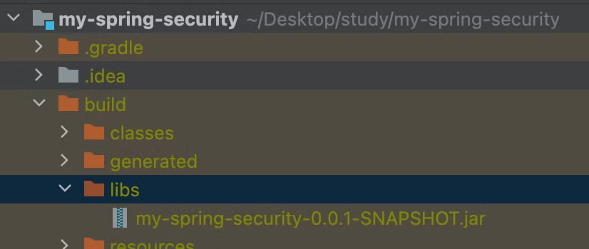
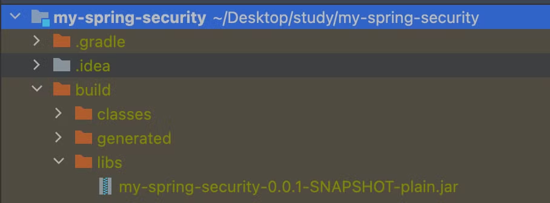
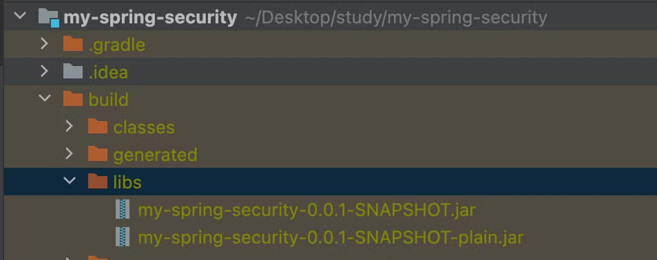
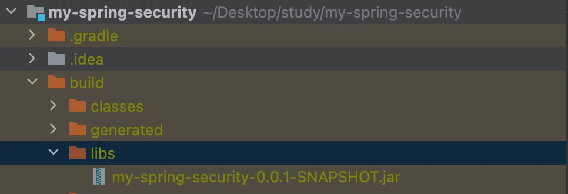

# gradle Tasks의 build와 bootJar차이

## bootJar

- 실행 가능한 jar파일을 생성한다.
- bootJar 명령으로 생성되는 파일은 `{project-dir}/build/libs/` 경로에 `{project-name}.jar` 으로 생성된다.

  

    ```groovy
    > Task :compileJava
    
    > Task :processResources
    > Task :classes
    > Task :resolveMainClassName
    > Task :bootJar
    ```


## jar

- 클래스 파일을 생성한다.
- `{project-dir}/build/libs/` 경로에 `{project-name}-plain.jar` 으로 생성된다.
- 단독으로 응용프로그램으로 실행할 수 없는 파일이지만, 라이브러리 등으로 배포할 때 사용할 수 있다.

    
 

## build

- build 태스크를 실행하면 {project-name}.jar와 {project-name}-plain.jar가 생성된다.

  

- 응용 프로그램 배포에서는 실행가능한 jar 파일이 필요하므로 `plain.jar` 는 필요 없으므로 build.gradle의 설정으로 생성되지 않도록 설정해두는 것도 좋다

    ```groovy
    jar {
        enabled = false
    }
    ```

    - build.gradle에 위처럼 설정해두면 build 태스크를 실행해도 plain.jar를 생성하지 않는다.

  

    ```groovy
    > Task :processResources
    > Task :classes
    > Task :resolveMainClassName
    > Task :bootJar
    > Task :jar SKIPPED
    > Task :assemble
    > Task :compileTestJava
    > Task :processTestResources NO-SOURCE
    > Task :testClasses
    > Task :test
    > Task :check
    > Task :build
    ```