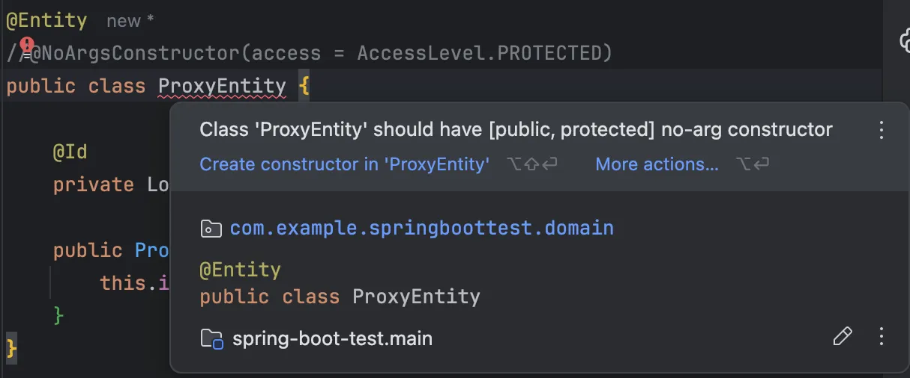

## JPA Entity는 왜 기본생성자가 필수일까?

- JPA는 엔티티 객체나 프록시 객체를 리플렉션을 통해 생성한다.
    - 리플렉션을 통해 객체를 생성하려면? → 기본생성자가 필수!



## Spring MVC 의 @RequestBody vs @ModelAttribute

- `@RequestBody`
    - Jackson을 사용해서 역직렬화를 한다.
    - 기본 생성자가 없는 경우도, 생성자 바인딩이 가능하기 때문에 기본생성자가 필수는 아니다.

    ```java
    @Getter
    public class JsonData {
    
        @JsonProperty("key") // 기본생성자는 필수가 아니지만 필드 인식이 가능하도록 public 필드로 만들거나, @JsonProperty를 명시해줘야 한다.
        private String key;
    
        public JsonData(String key) {
            this.key = key;
        }
    }
    ```

    ```java
    @Slf4j
    @RestController
    public class RequestBodyController {
    
        @PostMapping("/json")
        public String handleJson(@RequestBody JsonData data) {
            log.info("handle json data : {}", data);
            return "ok";
        }
    }
    ```


- `@ModelAttrubute`
    - 기본생성자 + setter(javaBean 방식)를 사용해서 역직렬화를 한다.
    - org.springframework.web.method.annotation.ModelAttributeMethodProcessor#constructAttribute
    - org.springframework.validation.DataBinder#construct
    - `Constructor<?> ctor = BeanUtils.*getResolvableConstructor*(clazz);`
        - 기본생성자로 객체 생성
        - `ph.setValue(valueToApply);` setter로 필드에 값 주입

            ```java
            public void setValue(@Nullable Object value) throws Exception {
                        Method writeMethod = this.pd.getWriteMethodForActualAccess();
                        ReflectionUtils.makeAccessible(writeMethod);
                        writeMethod.invoke(BeanWrapperImpl.this.getWrappedInstance(), value);
                    }
            ```

- **Spring 6.1, Spring boot 3.2+**
    - 생성자가 1개, 생성자 파라미터명과 요청 파라미터명이 일치, 파라미터 타입이 변환 가능한 타입이면 생성자 바인딩을 자동 지원한다.
    - 그래서 기본생성자와 setter 없이도 바인딩 성공

    ```java
    public class MyData {
        private String key;
    
        public MyData(String key) {
            this.key = key;
        }
    }
    ```


### **정리하자면,**

@RequestBody는 Jackson을 사용하여 JSON을 역직렬화한다. 이때 기본 생성자는 필수가 아니며, 생성자가 하나뿐이고 파라미터 이름이 JSON 필드와 일치하면 생성자 바인딩이 자동으로 이뤄진다.

단, Jackson이 필드를 인식할 수 있어야 하므로, 필드의 접근제어자가 public이거나 @JsonProperty가 명시되어 있어야 한다.

반면, @ModelAttribute는 JavaBean 방식으로 역직렬화를 수행하며, 기본 생성자를 통해 객체를 생성한 후 setter를 이용해 각 필드에 값을 주입한다. 따라서 기본 생성자와 setter가 모두 필요하다.

단, Spring Framework 6.1 이상 및 Spring Boot 3.2 이상에서는 생성자가 하나뿐이고 해당 생성자의 파라미터가 요청 파라미터와 일치할 경우, @ModelAttribute에서도 생성자 바인딩을 자동 지원하므로 기본 생성자나 setter 없이도 매핑이 가능하다.