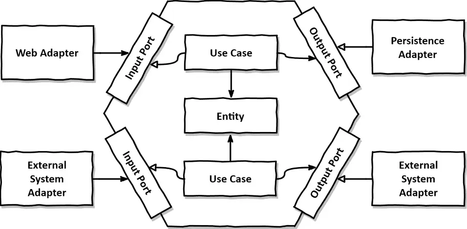

### 단일책임원칙 (SRP)

- 컴포넌트를 변경하는 이유는 오직 하나뿐이어야 한다.

### 의존성 역전 원칙 (DIP)

- 코드상의 어떤 의존성이든 그 방향을 바꿀 수(역전시킬 수) 있다.
- 의존성은 양쪽 코드를 모두 제어할 수 있을 때만 의존성을 역전시킬 수 있다.
- 도메인 코드와 영속성 코드 간의 의존성을 역전시켜서 영속성 코드가 도메인 코드에 의존하고, 도메인 코드를 변경할 이유의 개수를 줄여보자
    - 엔티티를 도메인 계층으로 올림 → 영속성 계층의 repository가 도메인 계층에 있는 엔티티에 의존하기 때문에 두 계층 사이에 순환 의존성이 생김
    - 도메인 계층에 repository에 대한 인터페이스를 만들고 실제 repository는 영속성 계층에서 구현

### 클린 아키텍처

- 클린아키텍쳐에서 비즈니스 규칙은 프레임워크, db 그밖의 외부 애플리케이션이나 인터페이스로부터 독립적일 수 있다.
- 도메인 코드가 바깥으로 향하는 어떤 의존성도 없어야 함
    - 의존성 역전원칙의 도움으로 모든 의존성이 도메인 코드를 향하고 있다
- 계층 간의 모든 의존성이 안쪽으로 향해야 한다
- 도메인 계층이 영속성이나 UI 같은 외부 계층과 철저하게 분리돼야 하므로 애플리케이션의 엔티티에 대한 모델은 각 계층에서 유지보수해야함
    - 영속성 계층에서 ORM 프레임워크를 쓴다고 하면, 도메인 계층은 영속성 계층을 모르기 때문에 도메인 계층에서 사용한 엔티티 클래스를 영속성 계층에서 함꼐 사용할 수 없고 두 계층에서 각각 엔티티를 만들어야 한다.

### 육각형 아키텍처

- 헥사고날 아키텍처
- 모든 의존성은 코어를 향한다.

[Hexagonal Architecture with Java and Spring](https://reflectoring.io/spring-hexagonal/)